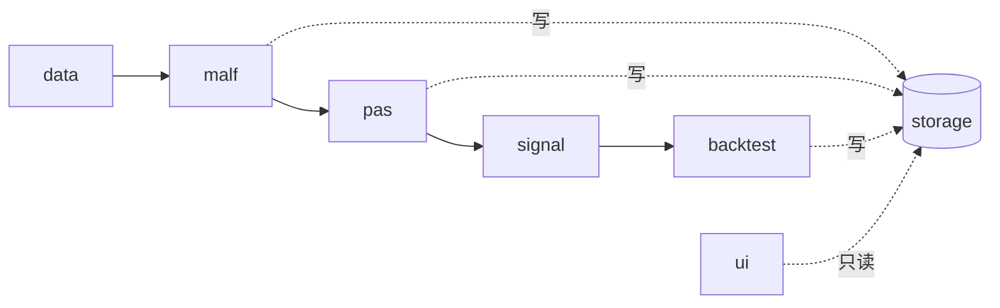
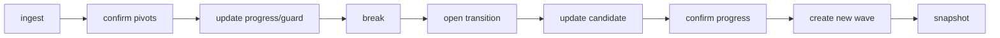

# CLAUDE.md

This file provides guidance to Claude Code (claude.ai/code) when working with code in this repository.

## 项目本质

个人、本地、A 股日线量化 MVP，复刻 MALF/PAS v1.5 形式化规范。

> **🔥 本次重构的核心目的**：砍掉上一版（`H:\Malf-Pas`）拖垮开发的治理机械——施工卡状态机、50+ TOML 注册表、6558 行 checks.py、16 个 DuckDB。**这一版治理只有 pytest + git，不要重新引入任何 gate/注册表/卡片机制。**

| 权威文档 | 内容 |
|---|---|
| `docs/REBUILD_PLAN.md` | 完整实现设计（分层/PAS/回测/调参/UI） |
| `docs/MALF_DESIGN.md` | MALF 单一权威规范（v1.0→v1.5 整合，图表化） |
| `docs/M*_SUMMARY.md` | 里程碑小结 |

> **文档约定**：能用图就用 Mermaid 图、能用表就用表，减少散文。

## 常用命令

```bash
pip install -e .[dev]                         # 安装（src 布局）
pytest                                        # 全部测试
pytest tests/test_malf_core.py::test_xxx -v   # 单个测试
python scripts/ingest_data.py --limit 5       # 灌数冒烟
streamlit run src/asteria/ui/app.py           # UI
```

> 测试用 `pyproject.toml` 的 `pythonpath=["src"]`，测试里直接 `from asteria...`。脚本/UI 用 `sys.path.insert` 注入 `src` 和仓库根（见 `scripts/ingest_data.py`），以便 `from config import settings`。

## 分层架构（严格单向，代码层强制不可越界）



| 层 | 目录 | 只产 / 边界 |
|---|---|---|
| **MALF** | `src/asteria/malf/` | 结构事实。不输出强弱分/setup/accept-reject/交易动作 |
| **PAS** | `src/asteria/pas/` | usage posture（5族×4档）。**禁读 PriceBar，禁重算 MALF** |
| **Signal** | `src/asteria/signal/` | 唯一做 accept/reject + 风报比。不回写上游 |
| **回测** | `src/asteria/backtest/` | 唯一拥有仓位/订单/成交/盈亏语义 |
| **storage** | `src/asteria/storage/` | 被各层调用但不反向依赖；`ui` 只读 |

> 每层 `types.py` 是纯数据契约（dataclass + 枚举），无副作用，最易测。

## MALF Core 状态机（系统心脏，最不能返工）

`malf/core.py` 的 `CoreEngine` 逐 bar 推进，**事件顺序固定（O2，9 步）**：



| 不变量（改动前务必理解） | 规则 | 源 |
|---|---|---|
| **严格比较** | break/confirmation 用 `<`/`>`，等于不触发。比较前 `normalize_price`（round 2 位，`pivot.py:PRICE_DP`） | O3 |
| **break 逐 bar 评估** | 用 bar.low/high；极值 bar 早于其确认 bar k 根，故 break 天然先于「违反 guard 的 pivot 确认」触发——无未来函数的关键 | — |
| **transition flip-flop** | 处理 transition 内新 pivot 时，先判它是否确认现有 active candidate（D16 "after"），不确认才让它成为新 active candidate | T5/O4 |
| **guard 唯一性** | HH/LL 只更新 progress_extreme；只有后续确认的 HL/LH 才替换 current_effective_guard | D9 |
| **初始化** | 结构不足时保持 uninitialized，**绝不**产生 break/transition | O6 |

> pivot 检测（`malf/pivot.py`）用分形确认（fractal-k），确认有 k 根延迟。规则版本 `fractal-k{k}-v1` 必须随快照记录（replay 可追溯）。

## 数据约定

| 项 | 约定 |
|---|---|
| **复权双轨** | 结构识别+回测用后复权（`qfq_back`，连续不跳空）；涨跌停判定用不复权（`raw_none`）。两套都 ingest，`price_bar.price_line` 区分 |
| **symbol 格式** | `600000.SH` / `300001.SZ` / `920000.BJ`。board 从代码前缀推断（`data/universe.py:infer_board`） |
| **TDX 源目录** | 实际是 `stock/<Adj>/`（非上一版 `stock-day/`）；GBK 编码；北交所 `BJ#920xxx` |

## 存储

SQLite WAL，三库分离（`storage/db.py`）：`market` / `malf_pas` / `backtest`。schema 在 `storage/schema.sql`，用 `-- @db: <name>` 注释分段，建库时按段执行。UI 用 `connect_ro()` 只读连接避免写锁争用。各层输出 append-only 快照。
