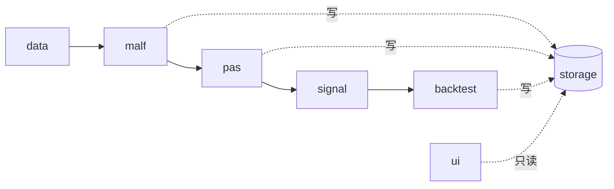
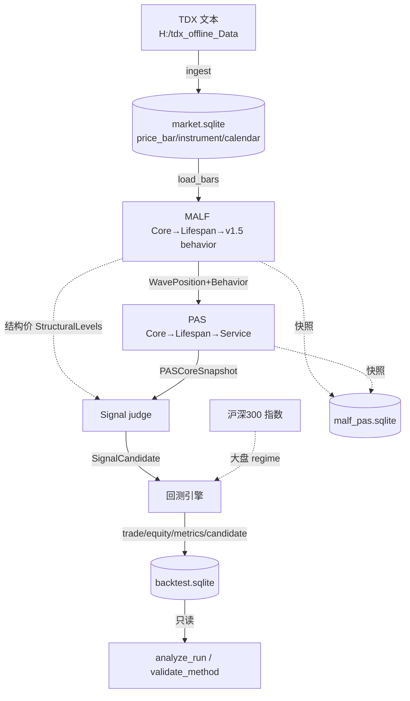

# 系统架构总览

> 全局入口。个人、本地、A 股日线量化 MVP，复刻 MALF/PAS v1.5 形式化规范。
> 模块细节见 `02-module-design/`；里程碑记录见 `04-implementation-records/`。

## 分层架构（严格单向，代码层强制不可越界）

## 各层职责边界

| 层 | 目录 | 只产 / 边界 |
|---|---|---|
| **data** | `src/asteria/data/` | TDX 文本 → DailyBar；复权双轨（qfq_back 结构价 / raw_none 涨跌停价）；asset_type 区分 stock/index |
| **MALF** | `src/asteria/malf/` | 结构事实（wave/pivot/guard/transition + lifespan + 6 regime）。**不**输出强弱分/setup/accept-reject/交易动作 |
| **PAS** | `src/asteria/pas/` | usage posture（5族×4档）+ premise + read + 证据。**禁读 PriceBar，禁重算 MALF**，不做 accept/reject |
| **Signal** | `src/asteria/signal/` | **唯一**做 accept/reject：质量门「2+N」+ 结构 RR≥1.5 + 结构 T1/T2。**不回写**上游 |
| **回测** | `src/asteria/backtest/` | **唯一**拥有仓位/订单/成交/盈亏语义；逐 bar 事件循环 + A 股规则 + 大盘过滤 |
| **storage** | `src/asteria/storage/` | 被各层调用但不反向依赖；SQLite 三库 WAL；`ui` 只读 |
| **ui** | `src/asteria/ui/` | Streamlit 只读；当前仅 Page3 结构可视化（M1） |

> 每层 `types.py` 是纯数据契约（dataclass + 枚举），无副作用，最易测。

## 数据流

## 三库分离（SQLite WAL，外置目录）

| 库 | 内容 | 写者 |
|---|---|---|
| `market.sqlite` | 行情（price_bar 双价线）/ instrument / trade_calendar | ingest |
| `malf_pas.sqlite` | MALF/PAS 逐 bar append-only 快照 | MALF/PAS writer |
| `backtest.sqlite` | param_set / backtest_run / bt_trade / equity / metrics / signal_candidate | backtest writer |

> 物理文件在外置兄弟目录 `G:\Asteria-malf-pas-data`（不进仓库）。分库 = 分散 SQLite 单写者写压力。

## 治理原则（本次重构的核心目的）

只有 **pytest + git**。砍掉上一版的施工卡状态机、50+ TOML 注册表、6558 行 checks.py、16 个 DuckDB——不重新引入任何 gate/注册表/卡片机制。

## 当前进度

M1-M4 ✅（数据/MALF/PAS/Signal+回测+交易方法+验证）；M5 ⏳（调参网格 + holdout 锁 + UI Page1/2）。第1套交易方法实证未达稳健、仍在迭代——见 `04-implementation-records/VALIDATION_FINDINGS.md`。
