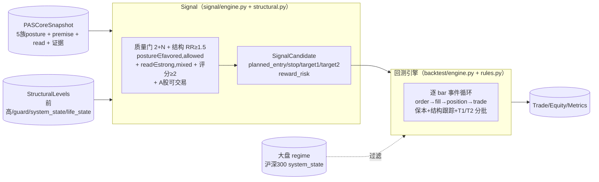
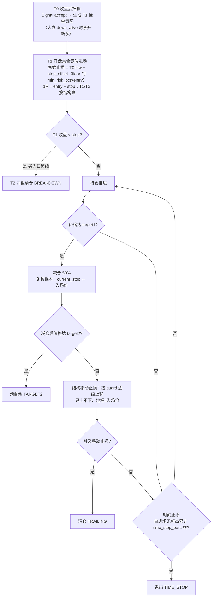
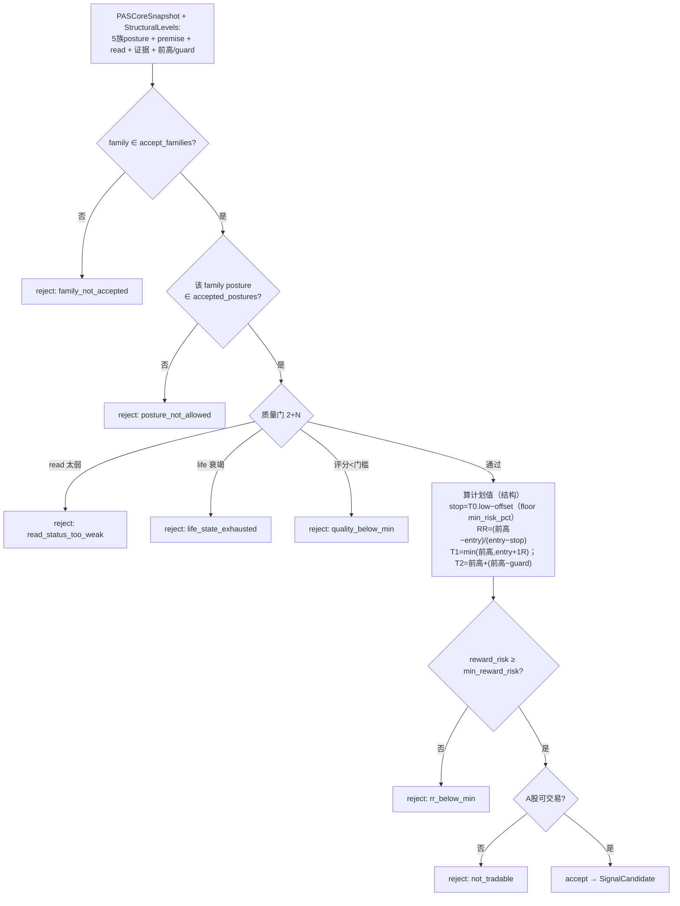
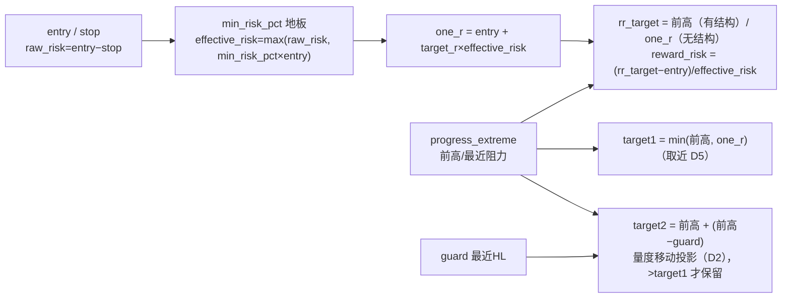
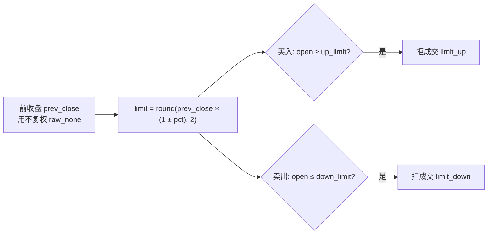
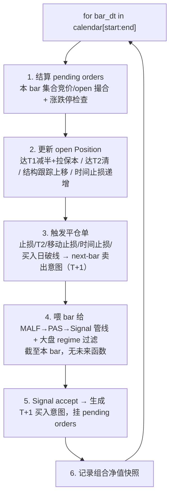
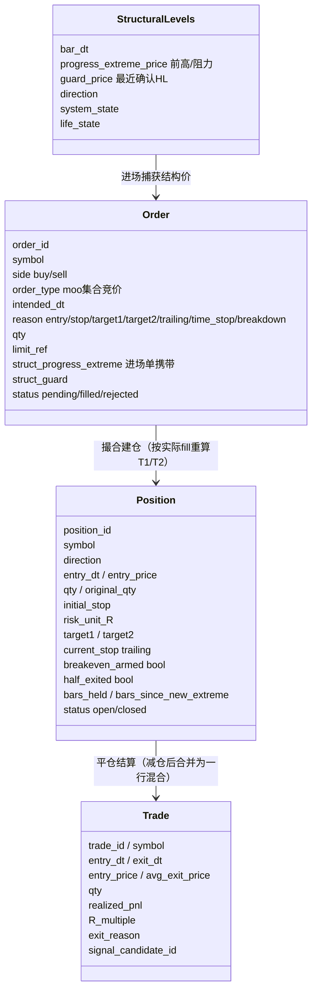
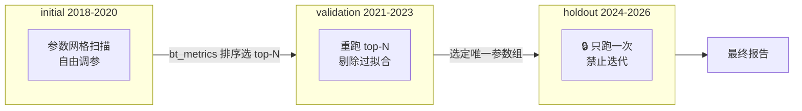

# 回测引擎 + Signal 设计（A 股特化，自写事件循环）

> **回测与 Signal 单一权威实现规范**。把 A 股交易规则、Signal 质量门 + accept/reject 判定、事件循环顺序钉死。
> **回测层是唯一拥有仓位/订单/成交/盈亏语义的层**——上游 MALF/PAS/Signal 都不碰这些。

| 权威边界 | 内容 |
|---|---|
| Signal 职责 | 读 PAS posture + **质量门（2+N 评级）** + **结构 T1/T2 + 可变风报比**，独立做 **accept/reject**，产 SignalCandidate（含进场/止损/T1/T2**计划值**） |
| 回测职责 | 唯一拥有仓位/订单/成交/盈亏；逐 bar 事件循环执行 A 股特化交易规则；可选大盘趋势过滤 |
| 为什么自写 | 规则太 A 股特化（T+1/集合竞价/涨跌停/1R 减半/保本+结构跟踪止损/时间止损/大盘过滤），现成框架（backtrader/backtesting.py）要硬掰、更易错 |
| 不做 | broker/paper-live/实盘对接 |

> **本文档同时是 Signal 裁决与回测引擎的单一权威规范**（一类信息一个主入口）。设计决策编号 D1–D5 见 `04-implementation-records/TRADING_METHOD_REFINEMENT.md`。

---

## 1. 职责切分

---

## 2. 用户交易规则（精确建模，不可走样）

时间轴：**T0 = 机会发现日**（收盘后扫描），**T1 = 进场日**，**T2 = 次日**。

### 规则逐条钉死

| # | 规则 | 形式化 |
|---|---|---|
| 1 | 机会发现 | T0 收盘后扫描，Signal accept → 生成挂单意图（大盘 ∈ bear_states 时禁开新多） |
| 2 | 进场 | T1 开盘集合竞价执行（按实际 fill price 重算权威 stop/1R/T1/T2，决策3） |
| 3 | 初始止损 | `stop = round(T0.low − stop_offset, 2)`，再 floor 到 `entry − min_risk_pct×entry`（取更宽者） |
| 4 | 风险单位 | `1R = entry − stop`；T1/T2 按结构算（见 §3 结构目标），无结构退 `entry + target_r×1R` |
| 5 | 买入日破线 | T1 收盘 `< initial_stop` → T2 开盘清仓（BREAKDOWN） |
| 6 | 达 target1 | `high ≥ target1` → 减仓 `scale_out_pct`（默认 0.5）**且拉保本**（`current_stop ← 入场价`） |
| 6b | 达 target2 | 减仓后 `high ≥ target2` → 清剩余（TARGET2，结构量度移动目标） |
| 7 | 移动止损 | 减仓后按 guard（最近确认 HL）逐级上移，**只上不下、地板=入场价**；触及即清仓（TRAILING） |
| 8 | 时间止损 | 自进场后无新高累计 `time_stop_bars` 根 → 退出（TIME_STOP，决策1） |
| 9 | A 股约束 | T+1（买入次日才可卖）；涨停无法买入、跌停无法卖出；集合竞价撮合 |

> **🔒 移动止损不变量（D1：保本第一）**：达 T1 后 `current_stop ← max(current_stop, 入场价)` 拉保本；之后按 guard/prev_HL 逐级上移、只上不下。**清仓价 ≥ 入场价**（绝不亏），但**可低于 target1**——这是四家经典实战（LanceBeggs/许佳冲/Volman/达瓦斯）的共识，旧的「清仓价必须 > target1」（`max(trail, target1+ε)`）已废弃。

---

## 3. Signal 判定（质量门 + 结构 RR + accept/reject）

判定 7 步顺序（`signal/engine.py:judge`），任一不过即 reject：

### 3.1 PAS 质量门「2+N 评级」（D4，吸收许佳冲信号分级）

`signal/engine.py:_quality_gate`——基本条件 + 评分双关：

| 项 | 规则 |
|---|---|
| **基本条件** | `read_status ∈ accepted_read_status`（默认 {strong, mixed}），否则 reject `read_status_too_weak` |
| **life_state 上限** | `accepted_life_states`（默认 {early, developing, extended}）排除 terminal/stagnant 衰竭波，挡顶部 climax；None=不卡 |
| **歧义硬否决** | `veto_ambiguity_dominates=True` 且 `ambiguity_dominates` → reject（默认关，posture 已反映 C6） |
| **评分（满分 5）** | posture=favored +1 / read=strong +1 / premise∈actionable_premises +1 / strength>weakness +1 / 无 C6 旗标(transition_bound/lineage_gap/ambiguity_dominates) +1 |
| **门槛** | `score < min_quality_score`（默认 2）→ reject `quality_below_min` |

### 3.2 结构目标 T1/T2 + 可变风报比（D2/D3/D5，`signal/structural.py`）

| 参数 | 默认 | 说明 |
|---|---|---|
| `accepted_postures` | `{favored, allowed}` | 接受哪些 posture 档位 |
| `accepted_read_status` | `{strong, mixed}` | 质量门基本条件 |
| `accepted_life_states` | `{early, developing, extended}` | life_state 上限（挡衰竭波）；None=不卡 |
| `min_quality_score` | 2 | 2+N 评分门槛 |
| `min_reward_risk` | 1.5 | 最小风报比门槛（对结构前高算，惰性路径已消除） |
| `min_risk_pct` | 0.02 | 最小风险距离占 entry 比例（floor，修 RR 虚高 + 控止损过紧） |
| `target_r` | 1.0 | 1R 基准目标倍数（无结构时退化用） |

> **可变 RR（D3）**：RR 对 MALF **结构前高**（`progress_extreme`）算，不再对 `entry+1R` 算——旧的 `reward_risk≡1.0` 惰性路径已消除。无结构前高（uninitialized/transition/前高≤entry）→ RR 退回 1.0 < 1.5 → 拒绝（只做有可测上行空间的干净上升波）。
> Signal 独立裁决（PAS C-T3）；reject 结果记 SignalFeedback，**不回写** PAS/MALF。

### 3.3 大盘趋势过滤（可选，无指数则关闭）

`backtest/engine.py:_scan_signals` 开头：`market_filter_enabled` 且大盘 regime ∈ `bear_states`（默认 {down_alive}）→ 跳过开新多单（**已持仓不强平**，让止损/跟踪自然出场）。大盘 regime 由 `runner.prepare_market_regime` 用沪深300(000300.SH) 跑 MALF 取 `system_state` 序列，引擎按 bar_dt 只读当日态（无未来函数，方案A）。

> ⚠️ 实证：MALF system_state 作大盘信号有滞后（沪深300 down_alive 在 2018 仅占 30%、2020 仅 7.4%），急跌市捕捉不及——见 `04-implementation-records/VALIDATION_FINDINGS.md`，regime 信号待迭代。

---

## 4. 涨跌停判定（撮合约束）

| board | 代码前缀 | 涨跌停 |
|---|---|---|
| 主板 main | 60/00 | ±10% |
| 创业板 chinext | 30 | ±20% |
| 科创板 star | 688 | ±20% |
| 北交所 bse | 8/4/920 | ±30% |
| ST | （名称含 ST/退） | ±5% |

> **复权双轨**：涨跌停用**不复权原始价**（`raw_none`）算限价，结构/进出场用**后复权**（`qfq_back`）。
> **MVP 简化**：集合竞价价 = T1 开盘价；`open ≥ up_limit` 买入失败、`open ≤ down_limit` 卖出失败（顺延）。board 精确化可后置。

---

## 5. 事件循环（backtest/engine.py，逐 bar 严格因果）

> **无未来函数铁律**：扫描只用 `<= bar_dt` 的数据；进场永远在发现日的**下一交易日** open。pivot 确认延迟 k 根天然满足因果（见 MALF_DESIGN §2.2）。

---

## 6. 关键数据结构（backtest/types.py，dataclass）

> **核心度量**：`R_multiple = realized_pnl / (risk_unit_R × original_qty)`——调参与统计的核心。
> **StructuralLevels（D2）**：MALF 结构价的只读投影，逐 bar 与 PAS 快照 1:1，由 `runner.prepare_symbol` 预算、引擎按 bar_dt 穿给 Signal/rules（无未来函数）。
> **混合记账（决策4）**：减仓 + 清剩余的多腿出场合并为**一行** Trade（`avg_exit_price` 加权、`qty` 用原始仓位、`exit_reason` 取最后一腿）。

---

## 7. 调参 / 分组回测

### 7.1 时间分组（🔒 硬隔离）

> **holdout 铁律**：整个调参过程**只能跑一次**。`tuning/runner.py` 对 holdout 加运行计数锁。

### 7.2 可扫描参数（全部来自 config/params_default.toml）

| 类别 | 参数 | 默认 |
|---|---|---|
| pivot | `pivot_k` | 2 |
| 止损 | `stop_offset` + `min_risk_pct`（止损距离地板，占 entry 比例） | 0.02 / 0.02 |
| 时间止损 | `time_stop_bars` | 5/8/13 |
| 移动止损 | `trail_method`（prev_hl / chandelier / atr）+ `trail_k` + `atr_period` | prev_hl / 3.0 / 14 |
| 目标 | `target_r` + `scale_out_pct` | 1.0 / 0.5 |
| Signal 质量门 | `accepted_postures` + `accepted_read_status` + `accepted_life_states` + `min_quality_score` | {favored,allowed} / {strong,mixed} / {early,developing,extended} / 2 |
| Signal 风报比 | `min_reward_risk`（对结构前高算） | 1.5 |
| 大盘过滤 | `market_filter_enabled` + `market_index_symbol` + `bear_states` | false / 000300.SH / {down_alive} |
| universe | 最小流动性 + 上市天数 | — |

> **prev_hl 已实现；chandelier/atr 留 M5 调参（当前抛 NotImplementedError）**。`min_risk_pct` 当前 0.02——实证显示对日线偏紧（见 VALIDATION_FINDINGS），放宽待验证。

---

## 8. 回测结果存储（backtest.sqlite）

| 表 | 用途 |
|---|---|
| `param_set` | 参数网格的一个点（params_json） |
| `backtest_run` | 一次回测（绑定 param_set + group_name + 数据 cutoff） |
| `bt_trade` | 逐笔成交（含 R_multiple / exit_reason） |
| `bt_equity_curve` | 逐 bar 组合净值 |
| `bt_metrics` | 汇总（total_return/cagr/max_dd/sharpe/win_rate/avg_R/expectancy/profit_factor） |
| `signal_candidate` | 每个发现的机会（含 accept/reject + planned 进出场 `planned_target1`/`planned_target2`/`reward_risk`） |

---

## 9. 实现映射（代码在哪）

| 设计层 | 代码 | 状态 |
|---|---|---|
| Signal 数据契约 | `src/asteria/signal/types.py` | ✅ |
| Signal 质量门 + accept/reject | `src/asteria/signal/engine.py` | ✅ |
| 结构 T1/T2 + 可变 RR | `src/asteria/signal/structural.py` | ✅ |
| 回测数据结构（含 StructuralLevels） | `src/asteria/backtest/types.py` | ✅ |
| A 股撮合（集合竞价/涨跌停/T+1） | `src/asteria/backtest/broker.py` | ✅ |
| 事件循环 + 大盘过滤 | `src/asteria/backtest/engine.py` | ✅ |
| 仓位管理（保本/减半/结构跟踪/T2/时间） | `src/asteria/backtest/rules.py` | ✅ |
| 绩效指标 | `src/asteria/backtest/metrics.py` | ✅ |
| 回测落库 | `src/asteria/storage/backtest_writer.py` | ✅ |
| 单组回测 CLI | `scripts/run_backtest.py` | ✅ |
| 跨组验证 + 分布分析 | `scripts/validate_method.py` + `scripts/analyze_run.py` | ✅ |
| 大盘 regime 预算 | `src/asteria/backtest/runner.py:prepare_market_regime` | ✅ |
| 分组调参网格（holdout 锁） | `src/asteria/tuning/grid.py` | ⏳ M5（空壳） |
| 持久化 schema | `storage/schema.sql` | ✅ |

---

## 10. 验证方式

1. **单标的手算对账**：选 1 标的 2-3 笔，手算 entry/stop/1R/结构 T1/T2/减半/保本跟踪/R_multiple，与引擎逐字段对账（`tests/test_backtest_engine.py`）。
2. **A 股约束**：`pytest tests/test_backtest_rules.py` + `test_backtest_broker.py`——T+1 当天不可卖、涨停拒买、跌停拒卖、买入日破线 T2 清仓、时间止损。
3. **质量门 + 可变 RR**：`tests/test_signal_engine.py` + `test_signal_structural.py`——2+N 评级各分支、RR 对结构前高算、无结构退化拒绝。
4. **无未来函数**：断言进场 dt = 发现 dt 的下一交易日；扫描 cutoff ≤ bar_dt；结构价/大盘 regime 只读 bar_dt 当日。
5. **保本不变量**：减仓后清仓价 ≥ 入场价（不再要求 > target1）。
6. **跨组验证**：`python scripts/validate_method.py --boards main --limit 200` 跑 initial/validation → `analyze_run.py` 看 R 分布/exit_reason/分层。🔒 holdout 绝不在验证/调参阶段跑。

> 当前测试规模见 `03-task-breakdown/TEST_ACCEPTANCE.md`。第1套方法的实证结论（含未达稳健的诚实记录）见 `04-implementation-records/VALIDATION_FINDINGS.md`。
