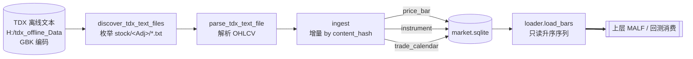
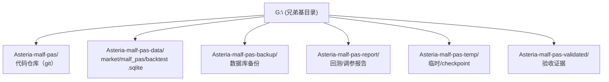
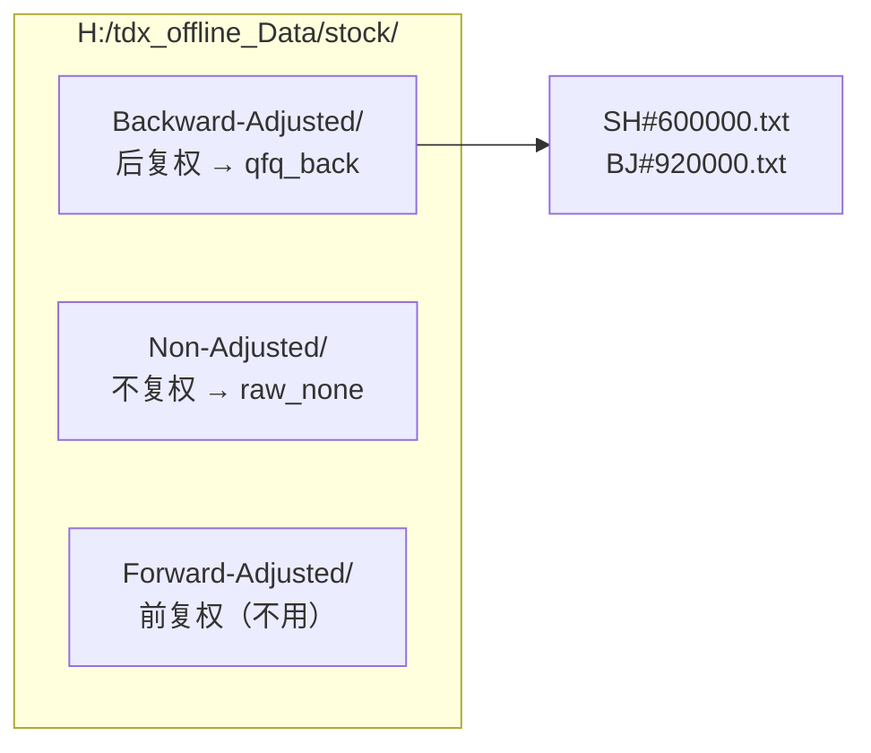
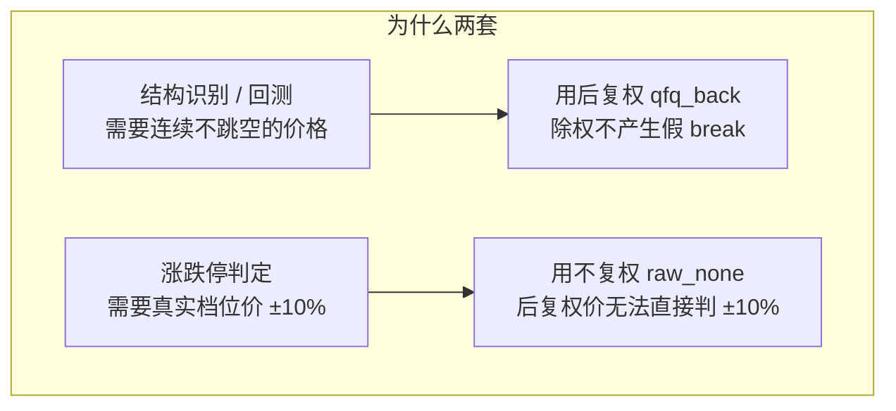
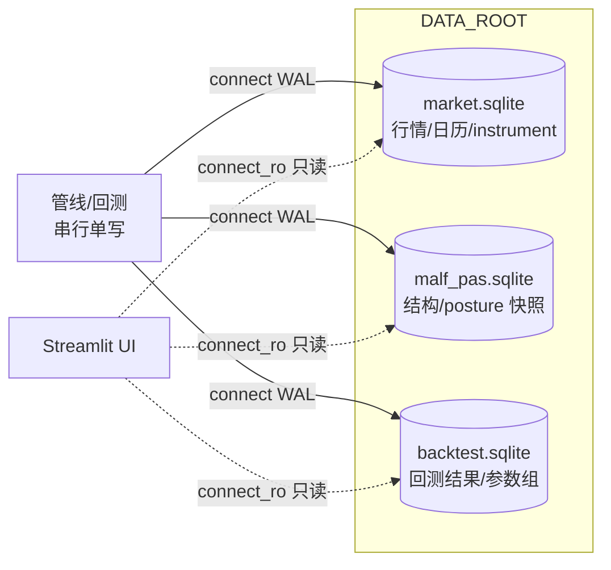
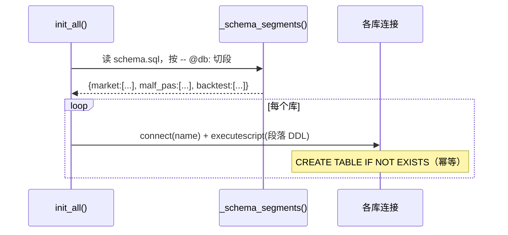
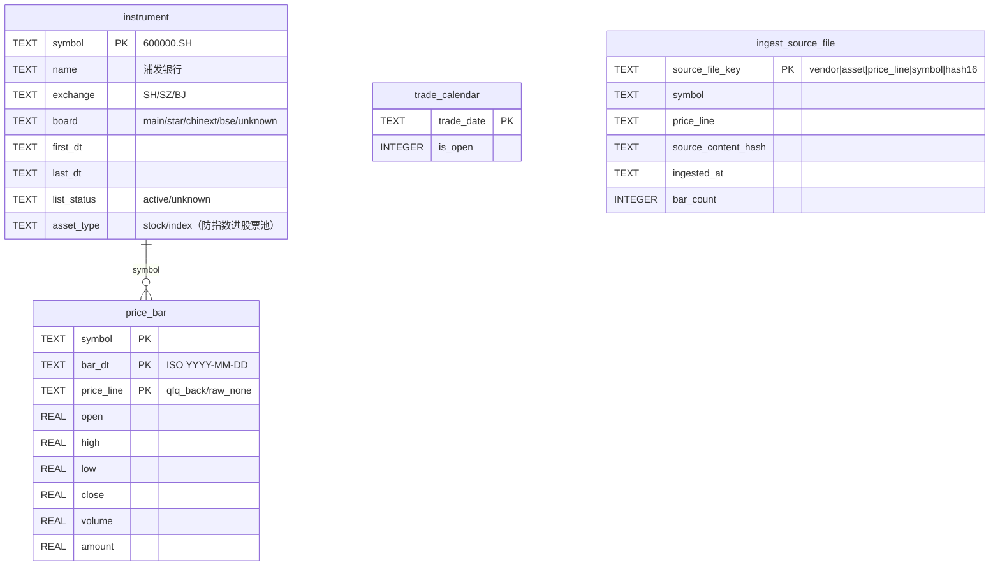
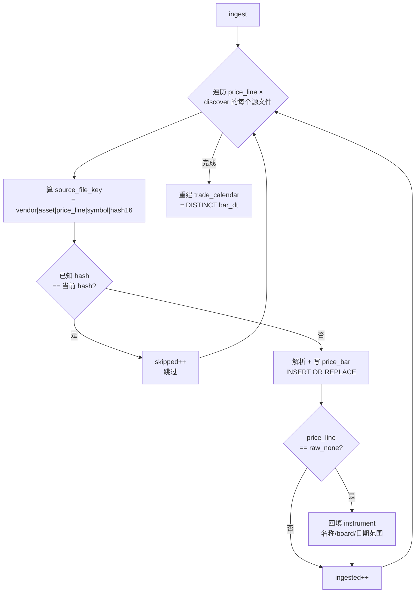
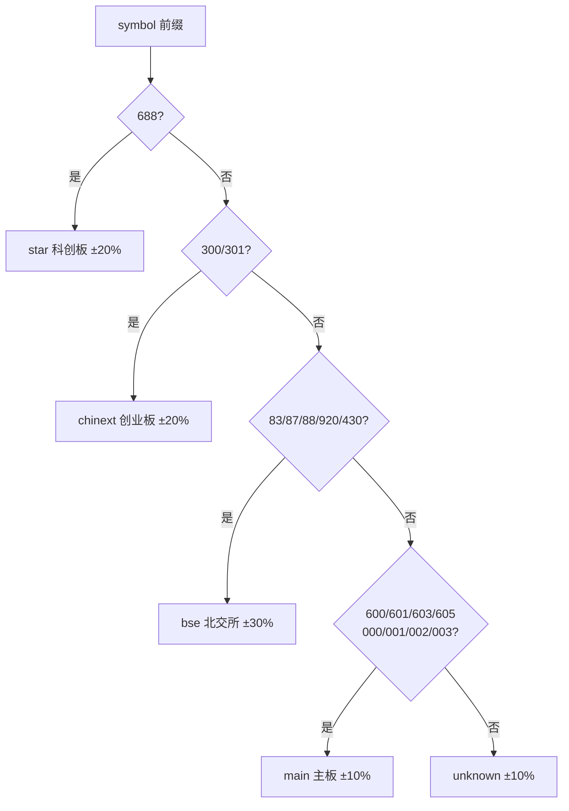

# 数据 / 存储 设计（DATA_STORAGE_DESIGN）

> **数据层与存储层的单一权威实现规范**。本文件描述的是**已落地的代码事实**（M1 已实现并验证），不是未来设想。
> 对应代码：`src/asteria/data/`（解析/灌数/筛选/读取）+ `src/asteria/storage/`（连接/建库/schema）+ `config/settings.py`（路径/常量）。

| 权威边界 | 内容 |
|---|---|
| 数据源 | TDX 本地离线文本（`H:/tdx_offline_Data`），只做 A 股日线 |
| 复权双轨 | `qfq_back`（后复权，结构+回测）/ `raw_none`（不复权，涨跌停判定） |
| 存储 | SQLite WAL，三库分离，物理文件在**外置兄弟目录**（不进仓库） |
| 争议裁决 | 本文件为准；与代码不一致时以代码为准并回改本文件 |

---

## 0. 数据流总览



---

## 1. 外置兄弟目录布局（数据严禁进仓库）

沿用上一版治理唯一保留的硬约束：**`.sqlite` 等数据产物禁止进仓库根目录**，统一放仓库的同级兄弟目录。



| 常量（`config/settings.py`） | 路径 | 用途 |
|---|---|---|
| `REPO_ROOT` | `G:\Asteria-malf-pas` | 代码仓库 |
| `DATA_ROOT` | `G:\Asteria-malf-pas-data` | 三库 .sqlite |
| `BACKUP_ROOT` | `G:\Asteria-malf-pas-backup` | 备份 |
| `REPORT_ROOT` | `G:\Asteria-malf-pas-report` | 报告 |
| `TEMP_ROOT` | `G:\Asteria-malf-pas-temp` | 临时/checkpoint |
| `VALIDATED_ROOT` | `G:\Asteria-malf-pas-validated` | 验收证据 |
| `TDX_SOURCE_ROOT` | `H:/tdx_offline_Data` | TDX 源（只读） |

> `ensure_external_dirs()` 在建库前确保 `DATA_ROOT / REPORT_ROOT / TEMP_ROOT` 存在。
> 仓库 `.gitignore` 仍排除 `*.sqlite / *.db / data/` 作为双保险——即便误放仓库内也不会被提交。

---

## 2. TDX 源数据格式（实测）



**文件内容实测**（`stock/Backward-Adjusted/SH#600000.txt`）：

```text
600000 浦发银行 日线 后复权          ← 第 1 行表头（symbol 名称 周期 复权）
      日期    开盘   最高   最低   收盘   成交量      成交额    ← 第 2 行列名
1999/11/10  29.50  29.80  27.00  27.75  174085000  4859102208.00
...
```

| 项 | 约定 | 代码 |
|---|---|---|
| 编码 | **GBK**（非 UTF-8，错用会乱码） | `tdx_text.py:read_text(encoding="gbk")` |
| 分隔 | 任意空白（tab/空格），`re.split(r"\s+")` | `parse_tdx_text_file` |
| 日期 | `YYYY/MM/DD`（兼容 `DD-MM-YYYY`） | `_parse_date` |
| symbol | `SH#600000` → `600000.SH`；`BJ#920000` → `920000.BJ` | `_normalize_symbol` |
| 列 | 日期/开/高/低/收/量/额（7 列，少于 7 列或首列非日期则跳过） | `parse_tdx_text_file` |
| 复权目录 | 实际是 `stock/<Adj>/`（**非**上一版 `stock-day/`） | `_FOLDER_BY_PRICE_LINE` |

---

## 3. 复权双轨（关键技术决策）



| price_line | 源目录 | 用途 | 谁消费 |
|---|---|---|---|
| `qfq_back` | Backward-Adjusted | 结构识别（pivot/wave/break）+ 回测进出场 | MALF Core、回测引擎 |
| `raw_none` | Non-Adjusted | 次日涨跌停限价判定 | 回测撮合（broker） |

两套都 ingest，`price_bar.price_line` 字段区分。`loader.load_bars` 默认 `price_line=qfq_back`（`settings.PRICE_LINE_STRUCTURE`）。

---

## 4. SQLite 三库（WAL）



### 4.1 连接策略（`storage/db.py`）

| 机制 | 实现 | 理由 |
|---|---|---|
| WAL 模式 | `PRAGMA journal_mode=WAL` | 并发读 + 单写，回测写入快 |
| 同步级别 | `PRAGMA synchronous=NORMAL` | WAL 下安全且快 |
| 外键 | `PRAGMA foreign_keys=ON` | 引用完整性 |
| 只读连接 | `connect_ro()` 用 `file:...?mode=ro` URI | UI 不抢写锁 |
| 分段建库 | schema.sql 用 `-- @db: <name>` 注释分段，按段执行 | 一份 DDL 管三库 |

> **分库理由**：三库物理分离，避免行情大表与回测频繁写入互相争用写锁。SQLite 单写者模型下，分库 = 分散写压力。

### 4.2 建库（幂等）



---

## 5. 行情库 market.sqlite schema



| 表 | 主键 | 说明 |
|---|---|---|
| `instrument` | symbol | 标的元信息，用 raw_none 那遍回填 |
| `price_bar` | (symbol, bar_dt, price_line) | 日线 OHLCV，两套复权并存 |
| `trade_calendar` | trade_date | 全市场 bar_dt 并集 |
| `ingest_source_file` | source_file_key | 灌数记账，增量跳过依据 |

---

## 6. 增量灌数（by content_hash）



| 行为 | 实现 | 说明 |
|---|---|---|
| 增量判定 | `source_content_hash` 比对 | 文件内容变了才重灌 |
| 写入方式 | `INSERT OR REPLACE` | 幂等，重灌不产生重复行 |
| instrument 回填 | 只在 `raw_none` 那遍做 | 用真实价/名称，避免后复权污染 |
| 无效行 | `open_px is None` 跳过 | 解析失败的行不入库 |
| 日历 | 每次 ingest 末尾全量重建 | `DELETE` + `INSERT SELECT DISTINCT bar_dt` |

---

## 7. symbol → board 推断与涨跌停比例

`data/universe.py:infer_board` 从代码前缀推断（无需外部表）：



| board | 涨跌停 | ST 时 |
|---|---|---|
| main / unknown | ±10% | ±5% |
| star / chinext | ±20% | ±5% |
| bse | ±30% | ±5% |

> ST 判定 `is_probably_st(name)`：名称含 `ST/*ST/退` → True，涨跌停收窄至 ±5%（`limit_pct(board, is_st=True)`）。

---

## 8. universe 筛选（全 A 股，剔除噪音）

`UniverseFilter`（dataclass，默认值即 MVP 策略）：

| 字段 | 默认 | 含义 |
|---|---|---|
| `min_list_days` | 365 | 上市 < 1 年剔除（次新股波动异常） |
| `min_avg_amount` | 0.0 | 最小日均成交额（0=不过滤，调参可收紧） |
| `exclude_st` | True | 剔除 ST/退市 |
| `exclude_boards` | () | 可排除特定 board（如只做主板） |

> MVP 阶段筛选条件**进 config 可调**，不写死。`describe()` 输出筛选签名，回测时记入 `backtest_run.universe_filter` 供审计。

---

## 9. 哪些进仓库 / 哪些不进

| 类别 | 进仓库？ | 位置 |
|---|---|---|
| 源码 / schema.sql / 配置 | ✅ | 仓库内 |
| 设计文档 | ✅ | `docs/02-module-design/` |
| `.sqlite` 数据库 | ❌ | `DATA_ROOT`（外置） |
| TDX 源文本 | ❌ | `H:/tdx_offline_Data`（只读源） |
| 回测报告 / 备份 | ❌ | `REPORT_ROOT` / `BACKUP_ROOT`（外置） |
| 临时 / checkpoint | ❌ | `TEMP_ROOT`（外置） |

---

## 10. MVP 简化与边界

| 项 | MVP 取舍 | 接口保留 |
|---|---|---|
| timeframe | 只做 day | `price_bar` 无 timeframe 列；上层快照表保留 timeframe 字段 |
| asset_type | **stock + index 都灌**（指数供大盘趋势过滤）；`instrument.asset_type` 区分，`select_symbols` 默认只选 stock，防指数进股票池 | `ingest()` 对 `(stock, index)` 双维度灌；旧库用 `_migrate_instrument_asset_type` 幂等加列 |
| 前复权 | 不灌 | `ADJ_FOLDER` 只映射 qfq_back/raw_none |
| block | 不做 | 解析器支持但 ingest 不调用 |
| 数据质量检查 | 靠 `open_px is None` 跳无效行 + pytest 解析测试 | 不建独立质检注册表（不重蹈上一版治理） |

---

## 11. 验证方式

```bash
# 灌数冒烟（前 N 个标的，两套复权）
python scripts/ingest_data.py --limit 5

# 全量灌数
python scripts/ingest_data.py
```

| 验证点 | 方法 | M1 实测 |
|---|---|---|
| 解析正确 | 中文名/board/日期范围/OHLCV | ✅ 600000 浦发银行 6278 bar |
| GBK 编码 | 无乱码读出中文名 | ✅ 安徽凤凰/纬达光电 |
| 增量跳过 | 二次 ingest 全 skipped | ✅ 6/6 skipped |
| board 推断 | 920→bse / 600→main | ✅ |
| 升序因果 | loader 返回 bar_dt 升序 | ✅ |
| 解析单测 | `pytest tests/test_data_ingest.py`（M2 补） | ⏳ |
