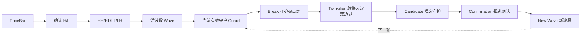
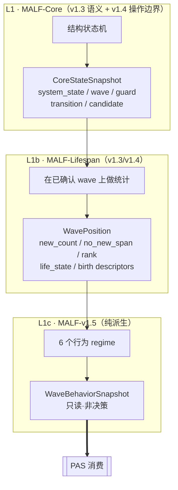
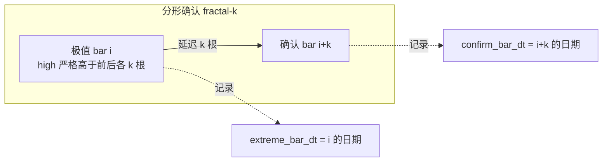
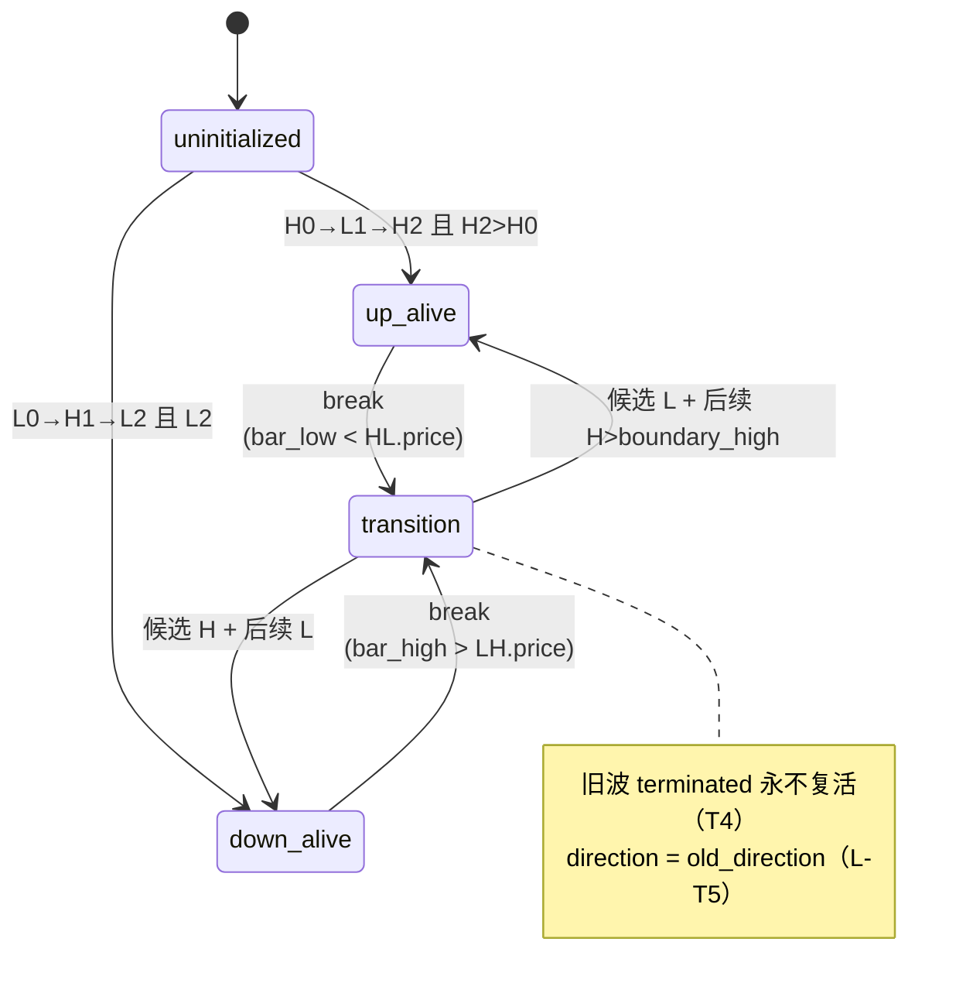
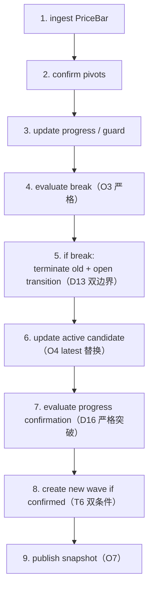
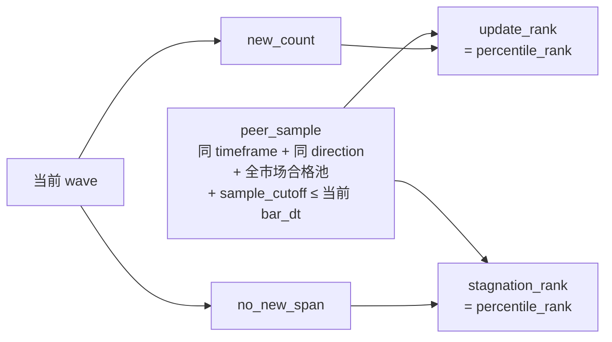
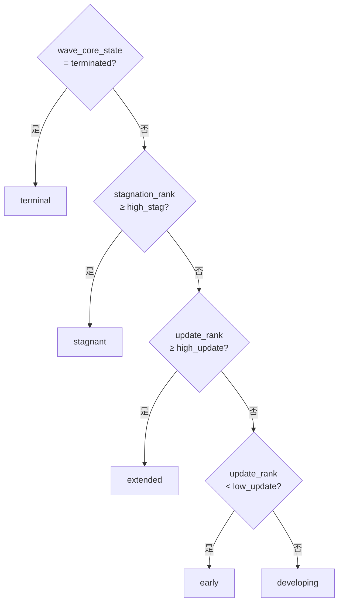

# MALF 重构版设计（整合 v1.0→v1.5）

> **MALF 单一权威实现规范**。把上一版分散在 5 个版本、9+ 份文件里的定义压缩成一份"照着就能写代码"的文档。
> 源出处：`H:\Malf-Pas-backup\malf-backup`（v1.0/v1.2/v1.3/v1.4/v1.5）。
> 条款编号沿用源文档（`D`=Core 定义，`T`=Core 定理，`O`=操作边界，`L`=Lifespan，`C`/`L(v1.5)`=行为 regime），便于回溯。

| 权威边界 | 内容 |
|---|---|
| 不可变锚点 | `MALF v1.4`（v1.3 语义 + v1.4 操作边界） |
| 后继层 | `MALF v1.5`（行为事实，纯派生，不改 v1.4 主定义） |
| 争议裁决 | 本文件为准；细节回查源文档对应编号 |

---

## 0. MALF 是什么 / 不是什么

**MALF（Market Analysis Logical Framework）= 结构事实层。** 输入价格序列，输出"市场结构现在是什么状态"的确定性事实链。

| MALF 回答 ✅ | MALF 不回答 ❌（交给下游） |
|---|---|
| 有没有活的上升/下降波？ | 该不该买卖？（→ Signal） |
| 当前守护点在哪？被击穿了吗？ | 适合用哪种 setup？（→ PAS） |
| 这条波推进了几次、停滞多久？ | 仓位多大、止损在哪？（→ 回测/Position） |
| 当前结构的行为 bucket？ | 强弱分值、胜率、预期收益？（**任何层都不产**） |

> **🔒 禁止越界铁律**（v1.5 01B §3）：MALF 永不输出
> `strength_score · strength_bucket · setup_family · triggered · accepted · rejected · order_intent · profit`

---

## 1. 三层结构

**三层桥接**（v1.5 Bridge §2）：`Core facts + Lifespan facts + Service lineage = wave_behavior_snapshot`

**为什么需要 v1.5**：PAS 不能回读 PriceBar、不能自己重算 MALF 结构，所以"行为刻画"这层必须由 MALF 自己补——但只能补**行为 bucket + 审计理由 + lineage**，不能补强弱结论。

---

## 2. L1 Core：结构状态机

### 2.1 基础对象（D1–D9）

| 对象 | 定义 | 关键点 |
|---|---|---|
| **PriceBar** (D1) | `symbol + timeframe + bar_dt + OHLC` | 一切结构最终追溯到它 |
| **Pivot** (D2) | 确认的 H 或 L | 确认规则由实现层指定（见 §2.2） |
| **Primitive** (D4) | HH/HL/LL/LH | 当前极值 vs 结构上下文 reference 比较 |
| **Direction** (D5) | up / down | up: 推进=HH 守护=HL；down: 推进=LL 守护=LH |
| **Wave** (D8) | 有向+起点+推进+守护+终止 | `wave_core_state ∈ {alive, terminated}` |
| **Current Effective Guard** (D9) | up=最近确认 HL；down=最近确认 LH | **唯一性**（T3）：任一时刻只有一个 |

> **🔒 Guard 唯一性铁律（D9/T3）**：HH/LL 推进只更新 `progress_extreme`，**只有后续确认的 HL（LH）才替换 guard**。这是 break 判定的根基。

### 2.2 pivot 检测（实现层规则，本版固定）

| 项 | 值 |
|---|---|
| 默认 k | `2` |
| 规则版本 | `fractal-k2-v1`（O1 要求记录，可调参） |
| 实现 | `src/asteria/malf/pivot.py::detect_pivots_incremental` |

### 2.3 初始化（D18 / O6）

| 初始方向 | 确认序列 | first guard |
|---|---|---|
| initial up | `H0 → L1 → H2` 且 `H2 > H0` | L1 |
| initial down | `L0 → H1 → L2` 且 `L2 < L0` | H1 |

> **🔒 O6 失败规则**：结构不足时保持 `uninitialized`，**绝不**产生 break/transition；更高 H 可替换 H0，更低 L 可替换 L0。

### 2.4 System State 状态机（D11）

> `system_state` 与 `wave_core_state` 永不混用（D11）。`wave_core_state` 只有 `alive/terminated`，不会是 transition。

### 2.5 Break（D10 / O3 严格比较）

| 方向 | break 条件 | 比较 |
|---|---|---|
| up wave | `bar_low < current_effective_HL.price` | 严格 `<` |
| down wave | `bar_high > current_effective_LH.price` | 严格 `>` |

> **🔒 O3 等于不触发**：`bar_low == guard_price` 不构成 break。价格比较前先归一化精度（`round` 2 位，`epsilon_policy = none_after_price_normalization`）。

Break 后：`old_wave → terminated`，`system_state → transition`，旧波永不复活（T4）。
Break 记 8 字段（D10）：`old_wave_id / old_direction / broken_guard_primitive / broken_guard_pivot_id / broken_guard_price / old_final_progress_extreme_pivot_id / old_final_progress_extreme_price / break_dt`。

### 2.6 Transition 双边界（D12 / D13）

| 旧波方向 | boundary_high | boundary_low |
|---|---|---|
| 旧 up wave break | old final HH price | broken HL price |
| 旧 down wave break | broken LH price | old final LL price |

> **🔒 D13 禁用**：不可用 break bar 的 high/low、不可用 transition 内临时高低（除非成为 active candidate）、不可用任意历史 H/L。Transition 不是 wave（T8）。

### 2.7 Candidate 与 New Wave（D14–D17 / O4 / T5 / T6）

| 规则 | 内容 | 源 |
|---|---|---|
| Active candidate | = latest candidate_guard，新候选一出现就替换旧的，不分同向反向 | O4/T5 |
| candidate direction | latest L → up；latest H → down | D15 |
| Progress Confirmation（up） | active candidate L 之后出现 H 且 `H > boundary_high`（严格） | D16 |
| Progress Confirmation（down） | active candidate H 之后出现 L 且 `L < boundary_low`（严格） | D16 |
| **New Wave 双条件** | `active_candidate_guard 存在` **且** 其后 `confirmation 突破边界`，缺一不可 | T6 |

### 2.8 事件顺序（O2，状态机心脏）

同一 `symbol+timeframe+bar_dt` 内固定 9 步：

> **🔑 本版关键裁决（解开 O2 step6/7 表面矛盾）**：transition 内处理新 pivot P 时，**先判 P 是否确认现有 active candidate**（D16 的 "after"），不确认才让 P 成为新 active candidate（T5 flip-flop）。
> 实现：`src/asteria/malf/core.py::CoreEngine._handle_transition_pivot`

### 2.9 CoreStateSnapshot（O7 发布契约）

逐 bar 发布，最小字段：`symbol / timeframe / bar_dt / system_state / active_wave_id / old_wave_id / direction(transition 时=old_direction) / wave_core_state / current_effective_guard_pivot_id / current_effective_guard_price / progress_extreme_* / open_transition_id / active_candidate_guard_pivot_id / active_candidate_direction / transition_boundary_high / low` + 版本字段。
实现：`src/asteria/malf/types.py::CoreStateSnapshot`。

---

## 3. L1b Lifespan：波段统计（v1.4，M2 实现）

> 建立在 Core 已确认 wave 之上，只描述生命统计位置，**不**确认 wave 是否成立。

### 3.1 计数（L2–L6）

| 字段 | 定义 | 边界 |
|---|---|---|
| `new_count` (L3) | progress primitive 更新累计（up 数 HH，down 数 LL） | guard primitive 不计数 |
| `no_new_span` (L4) | 自上次 progress update 的 bar 数 | 新波确认 bar=0；推进=0；alive 无推进=+1；terminated=冻结 |
| `transition_span` (L14) | break→新波确认的 bar 数 | **不并入** new wave 的 no_new_span（L5/L-T3） |

### 3.2 同类样本与 Rank（L7–L9）

> **本版 MVP 简化**：用全历史已完成 wave 的经验分布预计算分位表，`sample_version` 写死常量；接口字段全保留。`sample_cutoff ≤ 当前 bar_dt` 防前视。

### 3.3 Life State（L11，判定顺序固定）

阈值进 `config/params_default.toml`（L10 要求版本化；本版初值 `high_stag=0.8 / high_update=0.8 / low_update=0.2`）。

### 3.4 Position Quadrant（L12）

`update_rank × stagnation_rank` 的高/低组合，保留二维信息，不替代 life_state：

| update_rank \ stagnation_rank | 低 | 高 |
|---|---|---|
| **低** | early_active | early_stagnant |
| **高** | extended_active | extended_stagnant |
| 中间区 | developing | developing |

### 3.5 Birth Descriptors（L13–L17）

| 字段 | 定义 |
|---|---|
| `birth_type` (L13) | initial / same_direction_after_break / opposite_direction_after_break |
| `candidate_wait_span` (L15) | active candidate guard 出现 → confirmation 的 bar 数 |
| `candidate_replacement_count` (L16) | transition 内候选替换次数 |
| `confirmation_distance_abs/pct` (L17) | confirmation 突破 boundary 的距离（绝对/比例） |

### 3.6 WavePosition（L18，给 PAS 的主坐标）

= `system_state + wave_core_state + direction + new_count + no_new_span + transition_span + update_rank + stagnation_rank + life_state + position_quadrant + birth descriptors` + 版本字段。

> **🔒 Lifespan 铁律**：`rank 是历史位置不是概率`（L-T6）；`birth 描述形成过程不描述未来收益`（L-T7）；`system_state=transition` 时 `direction = old_direction`（L-T5）。

---

## 4. L1c v1.5 行为层：六个 regime（M2 实现）

> 纯派生，**只能从 v1.4 已确认结构事实派生**，不得引入强弱评分。

### 4.1 派生顺序（v1.5 01B §1，任何跳步不允许）

### 4.2 六个 regime

| regime | 取值 | 来源字段 | 源 |
|---|---|---|---|
| `continuation_regime` | advancing / slowing / stalled / transitioning | system_state, new_count, no_new_span, rank | C1 |
| `boundary_pressure_regime` | continuation_side / guard_pressure / transition_pressure / neutral | 与 guard/boundary 的关系 | C2 |
| `directional_continuity_regime` | same_direction_continuation / opposite_direction_rebirth / transition_unresolved | direction, old_direction, birth_type, system_state | C3 |
| `stagnation_regime` | fresh / watchful / stalled / terminal_pressure | no_new_span, stagnation_rank, life_state | L1(v1.5) |
| `transition_regime` | clean_handoff / replacement_heavy / prolonged_unresolved / not_applicable | transition_span, candidate_replacement_count, open_transition_id | L2(v1.5) |
| `birth_quality_regime` | clean_birth / negotiated_birth / costly_birth / unknown_birth | candidate_wait_span, candidate_replacement_count, confirmation_distance_* | L3(v1.5) |

> **🔒 比较铁律**（v1.5 01B §2）：
> - `transition` 优先于一切延续 bucket
> - 只有 `system_state != transition` 才给 active-wave continuation bucket
> - 无 `current_effective_guard` → 不输出 `guard_pressure`
> - 无 `confirmation_distance_*` → 不输出 birth_quality bucket
>
> bucket 分界阈值文档未给具体数值 → 进 `params_default.toml`。

### 4.3 WaveBehaviorSnapshot（v1.5 主接口，MALF_03）

| 字段组 | 内容 |
|---|---|
| identity | symbol / timeframe / bar_dt / service_version |
| lineage | source_run_id / lineage_hash / rule_versions |
| wave linkage | wave_id / direction / old_wave_id / open_transition_id |
| continuation | continuation_regime / directional_continuity_regime |
| pressure | stagnation_regime / boundary_pressure_regime |
| transition | transition_regime |
| birth quality | birth_quality_regime |
| audit | reason_codes |

`WaveBehaviorSnapshotLatest` = 每 symbol/timeframe 最新一条，只能从 snapshot 派生，**不得被 PAS 或下游写回**。

> **🔒 Service 铁律**（MALF_03 §4）：`WaveBehaviorSnapshot != strength score / setup family / accept-reject / order/position/fill/profit`。

---

## 5. 版本演进（为什么是现在这个形状）

| 版本 | 增量 | 本版取舍 |
|---|---|---|
| v1.0/v1.2 | Core 早期语义 | 已被 v1.3 取代，不实现 |
| **v1.3** | Core 语义闭环 + Lifespan birth descriptors | **语义基线**，照实现 |
| **v1.4** | 操作边界（O1–O8） | **不可变锚点**，照实现 |
| **v1.5** | 行为层（6 regime + WaveBehaviorSnapshot），纯派生 | **后继层**，M2 实现 |

> v1.4 一句话：`v1.3 把 Core 的"意思"讲清楚，v1.4 把"实现时怎么排队/比较/记账/重放"钉死`。
> v1.5 一句话：`只新增一层 successor 行为面，不改 v1.4 任何主定义`。

---

## 6. 实现映射（代码在哪）

| 设计层 | 代码 | 状态 |
|---|---|---|
| pivot 检测 | `src/asteria/malf/pivot.py` | ✅ M1 |
| Core 状态机 | `src/asteria/malf/core.py` | ✅ M1 |
| 结构数据契约 | `src/asteria/malf/types.py` | ✅ M1（含 Lifespan/behavior 字段占位） |
| Lifespan 统计 | `src/asteria/malf/lifespan.py` | ⏳ M2 |
| v1.5 行为派生 | `src/asteria/malf/behavior.py` | ⏳ M2 |
| Service 组装 | `src/asteria/malf/service.py` | ⏳ M2 |
| 运行封装 | `src/asteria/malf/runner.py` | ✅ M1（M2 扩展写库） |
| 持久化 | `src/asteria/storage/schema.sql`（malf_pas 库表已建） | ✅ M1 建表 |

### MVP 简化（接口保留完整，派生先简化）

| 规范项 | MVP 取舍 |
|---|---|
| Lifespan rank | 单一预计算样本，`sample_version` 常量 |
| lineage_hash / 完整 rule_versions | 先存简单字符串，不做哈希校验 |
| replay determinism（O8） | 靠 pytest 固定快照，不做自动 replay 审计 |
| `*Latest` 物化表 | 先用 `MAX(bar_dt)` 查询替代 |
| 多 timeframe / index / block | 只做 day + stock，字段保留 |

---

## 7. 验证方式

| # | 方式 | 命令 / 结果 |
|---|---|---|
| 1 | Core 正确性单测 | `pytest tests/test_malf_core.py`（break/transition/new wave + O3 边界 == 不触发） |
| 2 | 真实数据肉眼核对 | `streamlit run src/asteria/ui/app.py` → Structure Inspector → 600000（M1 已验：786 bar→34 wave→33 break，严格 break 逐条对账正确） |
| 3 | M2 验收 | WavePosition + WaveBehaviorSnapshot 字段齐全；transition 保留 old_direction；rank 单调性 sanity check；6 regime 派生查表确定性单测 |
