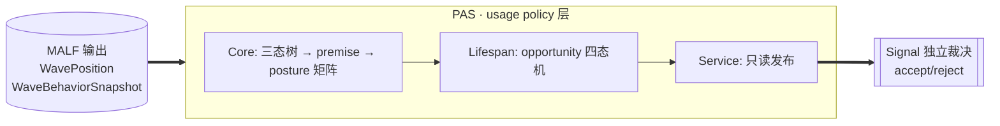
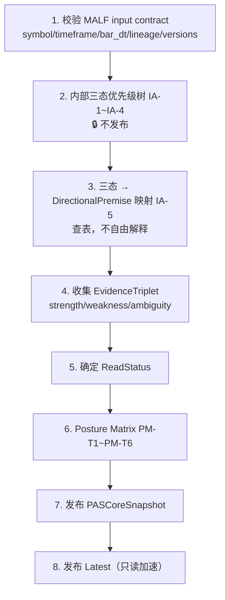
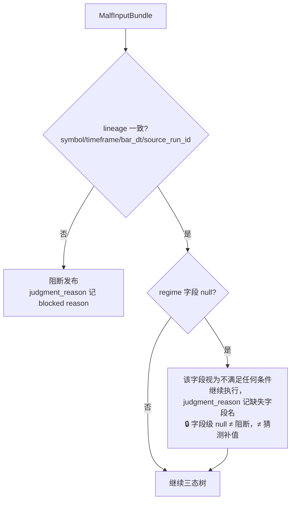
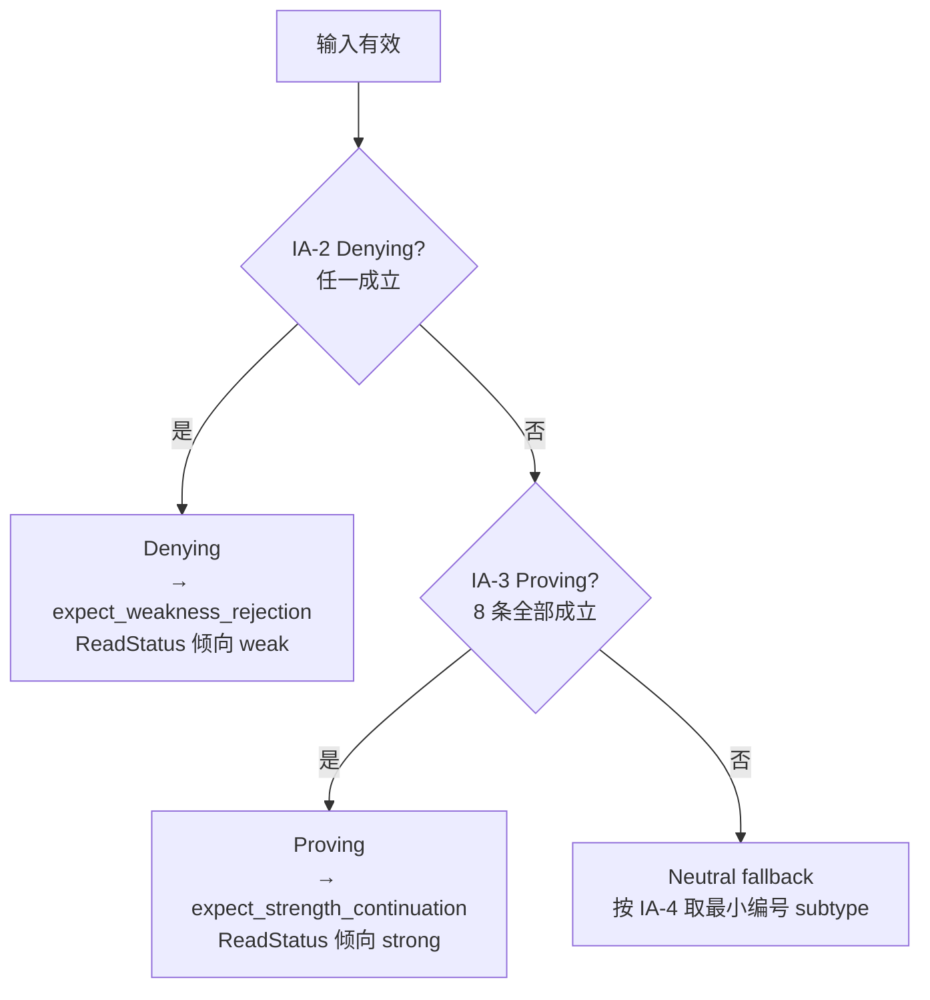
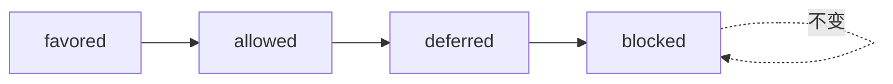
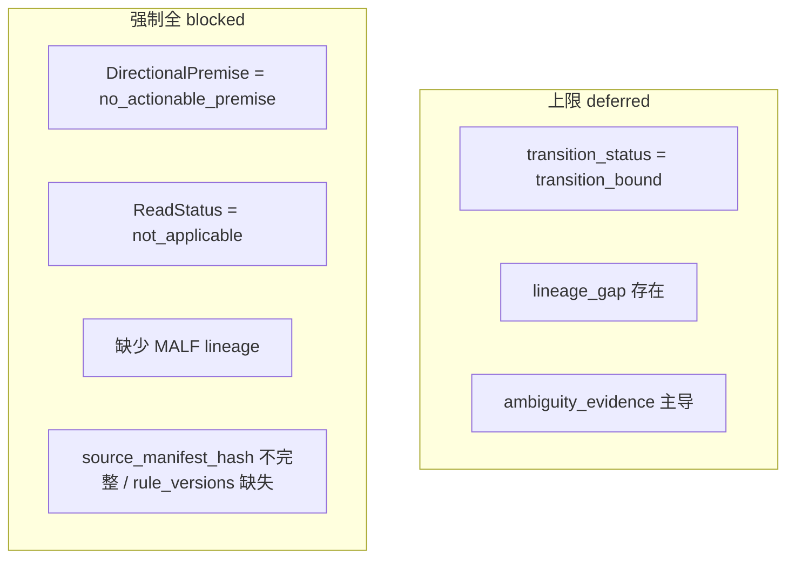
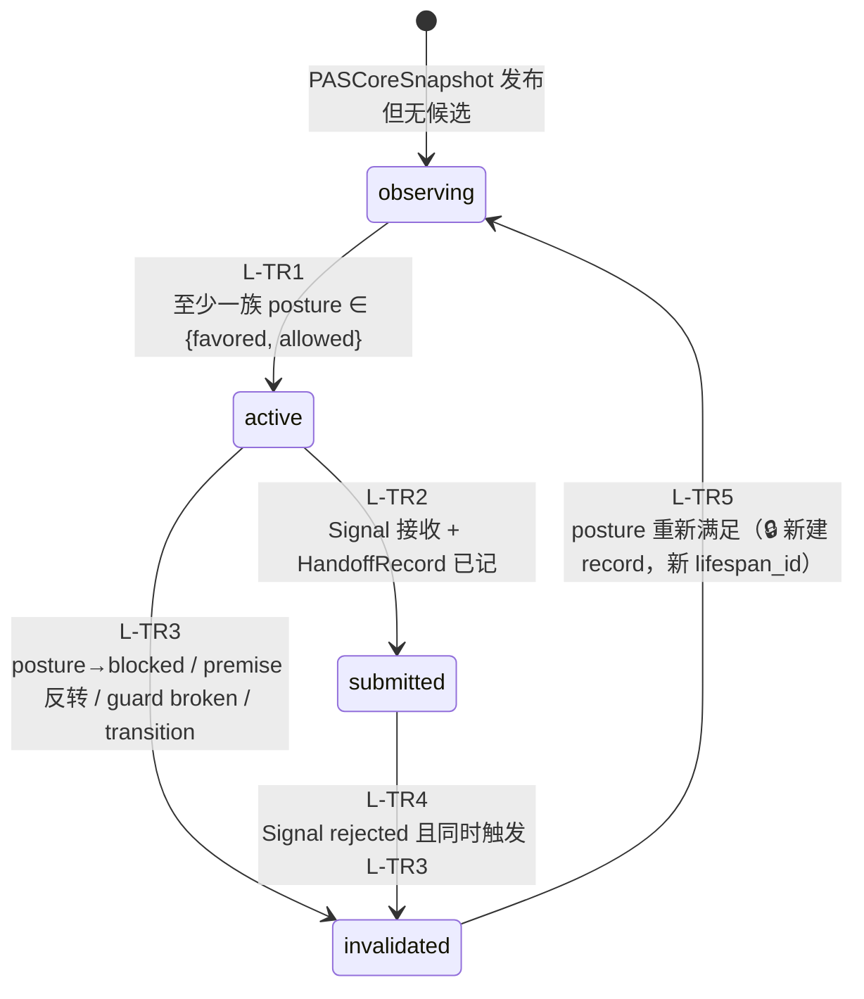
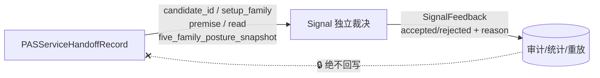

# PAS 重构版设计（整合 v1.5）

> **PAS 单一权威实现规范**。把 PAS v1.5 三层（Core/Lifespan/Service）+ Signal 反馈协议压缩成一份"照着就能写代码"的文档。
> 源出处：`H:\Malf-Pas-Validated\pas-backup\PAS_Three_Layer_Design_Set_v1_5`。
> 条款编号沿用源文档（`C`=Core 定义，`IA`=内部推导算法，`PM`=Posture 矩阵定理，`L`=Lifespan，`A`=公理，`C-T`=Core 定理，`C1~C12`=操作边界）。

| 权威边界 | 内容 |
|---|---|
| 定位 | PAS = MALF 之上的 **usage policy 层**，只回答"当前适合用什么 setup" |
| 唯一输入 | `WavePosition + WaveBehaviorSnapshot`（公理 A1，C8 禁读 PriceBar） |
| 唯一输出 | 5 族 setup posture（favored/allowed/deferred/blocked）+ opportunity window 四态 |
| 不做 | accept/reject（→ Signal）、买卖/订单/仓位（→ 回测）、强弱分值（任何层都不产） |
| 争议裁决 | 本文件为准；细节回查源文档对应编号 |

---

## 0. PAS 是什么 / 不是什么



| PAS 回答 ✅ | PAS 不回答 ❌ |
|---|---|
| 当前结构支持哪种方向性预期？（DirectionalPremise） | 该不该买卖？（→ Signal accept/reject） |
| MALF 证据偏强还是偏弱？（ReadStatus） | 进场价/止损/目标？（→ 回测） |
| 5 类 setup 各自适合用吗？（SetupPostureByFamily） | 仓位多大、盈亏多少？（→ 回测） |
| 这个机会窗口还有效吗？（Lifespan 四态） | 强弱分值、胜率？（**任何层都不产**） |

> **🔒 禁止越界铁律**（A3/A5/A6 + C4 + Service §8）：PAS 永不发布
> `三态标签(proving/denying/neutral/neutral_subtype) · strength_score · accept/reject · buy/sell · order/position/fill/profit`

---

## 1. 七条公理（PAS 立场根基）

| 公理 | 内容 |
|---|---|
| **A1** MALF-first | 输入 = MALF WavePosition + WaveBehaviorSnapshot，**≠ PriceBar** |
| **A2** Usage Policy Only | 输出 usage policy（favored/allowed/deferred/blocked），不是市场现实声明 |
| **A3** Three-State Is Internal | 三态（proving/denying/neutral）是内部推导机制，不公开 |
| **A4** No MALF Rewrite | 可解释 MALF，不能改写 MALF |
| **A5** No Action Output | 不输出订单/仓位/成交/收益/broker 指令 |
| **A6** Discrete Only | 只输出离散状态，不输出数值分数 |
| **A7** Lineage Required | 每个 PASCoreSnapshot 必须完整绑定 MALF lineage，否则不发布 |

---

## 2. PAS Core：确定性流水线

### 2.1 事件顺序（C2，固定 8 步）



> 步骤 1-6 **不得读取下游对象**（Lifespan/Service/Signal 结果）——C2/C9 单向铁律。

### 2.2 输入契约（C1）



### 2.3 内部三态优先级树（IA-1~IA-4，🔒 内部不发布）



**IA-2 Denying 条件**（任一成立即命中）：

| 条件 |
|---|
| `system_state = transition` |
| `current_effective_guard broken` |
| `life_state = terminal` |
| `continuation_regime = transitioning` |
| `stagnation_regime = terminal_pressure` |
| `boundary_pressure_regime = guard_pressure` |

**IA-3 Proving 条件**（8 条**全部**成立才命中；满足 7/8 且 Denying 未命中 → 必须 Neutral）：

| 条件 | 🔒 硬阈值 |
|---|---|
| `system_state ∈ {up_alive, down_alive}` | |
| `current_effective_guard exists and intact` | |
| `new_count >= 1` | |
| `life_state ∈ {early, developing}` | |
| `no_new_span < 5` | **< 5 写死** |
| `continuation_regime = advancing` | |
| `stagnation_regime ∈ {fresh, watchful}` | |
| `boundary_pressure_regime = continuation_side` | |

**IA-4 Neutral subtype**（多条同时成立取**最小编号**）：

| 优先级 | subtype | 条件 | 🔒 硬阈值 |
|---|---|---|---|
| 1 | `terminal_observation` | `no_new_span >= 20` | **>= 20** |
| 2 | `stagnant` | `no_new_span >= 10` 或 `stagnation_regime = stalled` | **>= 10** |
| 3 | `slowing` | `continuation_regime = slowing` | |
| 4 | `newborn` | `new_count = 0` | |
| 5 | `watchful` | 有效输入未命中以上 | |

### 2.4 IA-5：三态 → DirectionalPremise 映射（🔒 只查表，C5）

| 内部三态 | neutral_subtype | DirectionalPremise |
|---|---|---|
| Denying | — | `expect_weakness_rejection` |
| Proving | — | `expect_strength_continuation` |
| Neutral | `terminal_observation` | `no_actionable_premise` |
| Neutral | `stagnant` | `expect_boundary_test` |
| Neutral | `slowing` | `expect_boundary_test` |
| Neutral | `newborn` | `no_actionable_premise` |
| Neutral | `watchful` | `expect_transition_resolution` |

### 2.5 ReadStatus（C4）

`ReadStatus ∈ {strong, weak, mixed, ambiguous, not_applicable}`，由 EvidenceTriplet 主导成分决定：strength 主导→strong，weakness 主导→weak，混合→mixed，歧义主导→ambiguous，无有效输入→not_applicable。

### 2.6 Posture Matrix（PM-T1~T6，🔒 确定性查表）

输入 `(DirectionalPremise, ReadStatus)` → 五族 posture：

| 定理 | 触发条件 | TST | BOF | BPB | PB | CPB |
|---|---|:---:|:---:|:---:|:---:|:---:|
| **PM-T1** | strength_continuation + strong | allowed | blocked | **favored** | **favored** | deferred |
| **PM-T2** | weakness_rejection + weak | allowed | **favored** | blocked | blocked | deferred |
| **PM-T3** | boundary_test + mixed | **favored** | allowed | deferred | deferred | deferred |
| **PM-T4** | transition_resolution + ambiguous | deferred | deferred | blocked | blocked | blocked |
| **PM-T5** | no_actionable_premise 或 not_applicable | blocked | blocked | blocked | blocked | blocked |

**PM-T6 降档**（C7：在 PM-T1~T5 结果**之后**执行，**只降一次不迭代**）：



ReadStatus 与 DirectionalPremise 不匹配时，全部 posture 按上图降一档。

### 2.7 Posture 上限约束（C6）



### 2.8 Core 定理（C-T1~C-T4）

| 定理 | 内容 |
|---|---|
| **C-T1** Core Is Upstream Only | 派生链单向；Lifespan/Service/Signal/Position/Trade 不得回写 Core |
| **C-T2** Structure Stays Upstream | 结构事实/行为事实仍属 MALF，Core 只消费不拥有 |
| **C-T3** Posture Is Not Signal | favored/allowed/deferred/blocked ≠ accept/reject ≠ buy/sell |
| **C-T4** Deterministic | 相同 (premise, read) 必产相同 SetupPostureByFamily |

---

## 3. PAS Lifespan：opportunity 四态机

> 管理 **机会窗口有效性**，不是 market state。Wave 没有 lifespan（MALF 结构事实），Opportunity 有 lifespan（PAS 对结构的 usage 解释）。



| 状态 | 含义 |
|---|---|
| `observing` | 有 PASCoreSnapshot，但尚无候选 |
| `active` | 候选形成，至少一族 favored/allowed，等待 Signal |
| `submitted` | 已提交 Signal，等 accept/reject |
| `invalidated` | 前提破坏（Core 更新致 premise/posture 反转） |

| 定理 | 内容 |
|---|---|
| **L-T3** Invalidation ≠ Signal Rejection | `invalidated` 由 MALF/Core 变化触发，**不**由 Signal 裁决触发 |
| **L-T4** Submitted ≠ Accepted | `submitted` 仅表示已提交；裁决结果在 SignalFeedback，不回写 LifespanState |
| **L-T5** New Window = New Record | 从 invalidated 重新观察必须新建 record，不复用旧 lifespan_id |
| **L-T6** Posture Determines Activity | `active` = "当前 posture 至少一族可用"，≠ "Signal 会 accept" |

---

## 4. PAS Service：只读发布层

> 不新增解释、不做裁决、不输出交易动作。把 Core/Lifespan 结果封装为下游稳定接口。`Latest` 只是 append-only 读加速，非新语义。

### 4.1 PASCoreSnapshot 发布字段（C9 + Service §3）

| 字段组 | 字段 |
|---|---|
| identity | `core_snapshot_id / symbol / timeframe / bar_dt` |
| lineage | `malf_wave_position_id / wave_behavior_snapshot_id / source_run_id / source_manifest_hash` |
| context | `pas_context`（结构事实摘要） |
| premise | `directional_premise`（5 值） |
| read | `read_status`（5 值） |
| evidence | `strength_evidence[] / weakness_evidence[] / ambiguity_evidence[]` |
| posture | `tst_posture / bof_posture / bpb_posture / pb_posture / cpb_posture` |
| audit | `judgment_reason / posture_derivation_reason / premise_mapping_branch / posture_theorem_branch` |
| version | `pas_core_rule_version` |

> **🔒 禁止发布字段**（C4 + Service §3）：
> `structure_interpretation · proving/denying/neutral · neutral_subtype · strength_score/weakness_score · accept/reject/buy/sell · order/position/fill/broker_instruction/profit`

### 4.2 其他 Service 接口

| 接口 | 关键字段 | 禁止字段 |
|---|---|---|
| **PASCandidateRecord** | candidate_id / setup_family / premise / read / 五族 posture / posture_theorem_branch / candidate_reason | accept/reject、entry/stop/target、reward-risk、三态标签 |
| **PASLifespanRecord** | lifespan_id / setup_family / lifespan_state / state_reason / transition_history[] | — |
| **PASServiceHandoffRecord** | handoff_id / candidate_id / lifespan_id / setup_family / premise / read / `five_family_posture_snapshot`（不可变） | — |

### 4.3 版本绑定（C3）

```text
pas_core_rule_version            = pas-core-v1.5
pas_internal_three_state_version = pas-three-state-internal-v1.5
pas_premise_mapping_version      = pas-premise-map-v1.5
pas_neutral_subtype_version      = pas-neutral-subtype-v1.5
pas_posture_matrix_version       = pas-posture-matrix-v1.5
malf_input_contract_version      = malf-v1.5
pas_lifespan_rule_version        = pas-lifespan-v1.5
pas_service_contract_version     = pas-service-v1.5
```

---

## 5. PAS → Signal 交接（SignalFeedback 协议）



| 规则 | 内容 |
|---|---|
| Signal 接收 | candidate_id / setup_family / directional_premise / read_status / five_family_posture_snapshot / handoff_dt |
| Signal **不**接收 | 三态标签、数值分数、accept/reject 建议（Signal 独立裁决） |
| SignalFeedback 用途 | 仅审计 / 统计 / 重放 |
| SignalFeedback 🔒 禁止 | 回写 PASCoreSnapshot、改 LifespanState、影响 MALF、产生仓位/订单/成交 |

> **铁律**：SignalFeedback 是审计闭环，不是控制回路。PAS 不依赖 Signal 反馈更新自己。

---

## 6. 实现映射（代码在哪）

| 设计层 | 代码 | 状态 |
|---|---|---|
| PAS 数据契约（枚举+dataclass） | `src/asteria/pas/types.py` | ⏳ M3 |
| 三态树 + IA-5 + Posture 矩阵 | `src/asteria/pas/core.py` | ⏳ M3 |
| opportunity 四态机 | `src/asteria/pas/lifespan.py` | ⏳ M3 |
| Service 组装 + Handoff | `src/asteria/pas/service.py` | ⏳ M3 |
| 持久化 | `storage/schema.sql`（pas_core_snapshot / pas_lifespan_* 已建表） | ✅ M1 建表 |

### MVP 简化（接口保留完整，派生先简化）

| 规范项 | MVP 取舍 | 接口保留 |
|---|---|---|
| EvidenceTriplet 详细证据 | 先存命中的 regime 名列表 | 三数组字段保留 |
| reason 全文 | 短 enum/分支名 | judgment_reason 等字段保留 |
| lineage_hash / source_manifest_hash | 简单字符串常量或 run_id | 字段列保留 |
| `*Latest` 物化表 | SQL `MAX(bar_dt)` 查询 | 后续可加 |
| 内部三态调试字段 | 标 `internal_only`，不入库或单独调试表 | — |

---

## 7. 验证方式

1. **Posture 矩阵确定性**：`pytest tests/test_pas_core.py`——5 premise × 5 read 全枚举，断言 PM-T1~T5 输出 + PM-T6 降档只降一次 + C6 上限约束。
2. **三态树边界**：IA-3 满足 7/8 必落 Neutral；IA-4 多条命中取最小编号；硬阈值（no_new_span 5/10/20）边界用例。
3. **四态机**：L-TR1~L-TR5 转移；L-T3 Signal rejected 单独不触发 invalidated；L-T5 新窗口新 record。
4. **禁止字段**：快照发布面断言不含三态标签/数值分/交易动作字段。
