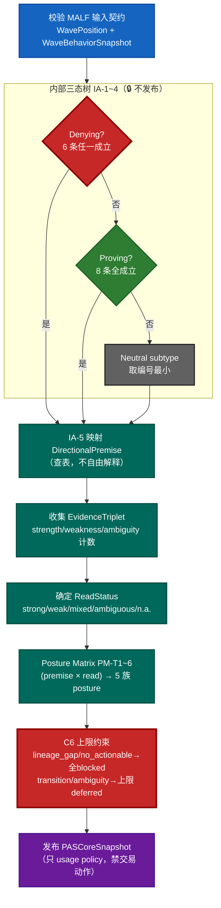
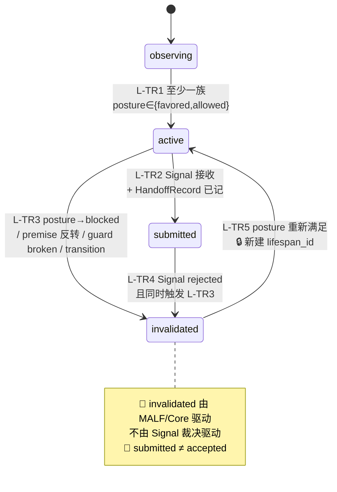

# M3 阶段小结：PAS v1.5 → usage posture 层首次真实落地

日期：2026-06-12
状态：已完成并验证

## 目标

在 MALF 之上建第一 usage policy 层。PAS 消费 `WavePosition + WaveBehaviorSnapshot`（公理
A1，禁读 PriceBar、禁重算 MALF），逐 bar 推导「当前适合用什么 setup」——5 族 × 4 档 posture，
**不做 accept/reject**（那是 Signal 的事）。三层：Core（三态树→premise→read→posture matrix）、
Lifespan（机会窗口四态机）、Service（只读发布）。

## 本质区别：延续 M1/M2，仍然没有 block

全程没有施工卡、没有治理注册表、没有 `checks.py`。每一步都是：写代码 → 跑测试 →
跨版本核对。治理只保留 pytest + git。分四步推进，每步独立可测：
契约 → Core 流水线 → Lifespan 四态机 → Service 只读面。

## 已交付且验证

| 层 | 模块 | 验证 |
|---|---|---|
| 契约 | `pas/types.py`：premise/read/posture/family 枚举 + `PASCoreSnapshot` + `PASLifespanRecord` + Handoff/Feedback | 字段与 `schema.sql` 表对齐；禁止字段集（三态标签/分数/accept/order）不入库 |
| Core | `pas/core.py`：三态树(IA-1~5) → premise → EvidenceTriplet → ReadStatus → Posture Matrix(PM-T1~6) → C6 上限 | 三态树 7 分支 + PM 全枚举 25 格 + 单步降档 + C6 三路径 |
| Lifespan | `pas/lifespan.py`：四态机 observing/active/submitted/invalidated（L-TR1~5） | 14 单测，含 invalidated 由 MALF 驱动、submitted≠accepted、新窗口新 id |
| Service | `pas/service.py`：Latest 快照/候选查询 + Handoff 记录，SignalFeedback 不回写 | 随 Core/Lifespan 用例覆盖 |

合计 **PAS 专项 47 单测全绿**（core 33 + lifespan 14），叠加 M1/M2 共 **103 全绿无回归**。

## PAS Core 确定性流水线（C2，不可跳步）



> 🔴 红块 = 风险/收口节点（Denying 触发 weakness、C6 强制压档）；🟢 绿块 = 校验通过路径；
> 🔵 蓝块 = 输入边界；🟣 紫块 = 发布边界。

## Posture Matrix（PM-T1~T6，确定性查表）

| 定理 | 触发 (Premise + Read) | TST | BOF | BPB | PB | CPB |
|---|---|---|---|---|---|---|
| PM-T1 | strength_continuation + strong | allowed | blocked | **favored** | **favored** | deferred |
| PM-T2 | weakness_rejection + weak | allowed | **favored** | blocked | blocked | deferred |
| PM-T3 | boundary_test + mixed | **favored** | allowed | deferred | deferred | deferred |
| PM-T4 | transition_resolution + ambiguous | deferred | deferred | blocked | blocked | blocked |
| PM-T5 | no_actionable / read=not_applicable | blocked | blocked | blocked | blocked | blocked |
| PM-T6 | premise 与 read 不匹配 | 全体降一档（favored→allowed→deferred→blocked），**只降一次** |

## PAS Lifespan 四态机（L-TR1~5）



> 🔴 两条铁律：invalidated 只由 MALF 结构变化触发（L-T3），与 Signal accept/reject 严格分离；
> submitted 仅表示已交给 Signal，≠ accepted（L-T4）。从 invalidated 复活必须新建 lifespan_id（L-T5）。

## 验收点核对（REBUILD_PLAN §9 M3 + §12 测试口径）

| 验收点 | 规则 | 验证 |
|---|---|---|
| **posture matrix 全枚举确定性** | 25 格 (premise × read) 查表唯一 | `test_posture_matrix_full_enumeration`（参数化 25 例）+ `_oracle_is_complete` |
| **PM-T6 降档仅一次** | mismatch 降一档，绝不连降两档 | `test_pm_t6_downgrade_is_single_step_only`（逐格反证不等于降两档） |
| **C6 上限** | transition_bound / lineage_gap / ambiguity_dominates 三路径 | `test_c6_*` 三例 |
| **三态树照搬硬阈值** | IA-3 `no_new_span<5`、IA-4 `≥20/≥10` | `test_tri_state_*` 7 例 |
| **四态机正确** | L-TR1~5 + invalidated 非 Signal 驱动 + 新窗口新 id | `test_tr*` + `test_full_lifecycle_sequence` |

> **全枚举测法关键**：直接测纯查表函数 `_posture_matrix(premise, read)`，**绕过三态树可达性**。
> 很多组合（如 strength_continuation+weak）在流水线上不可达，但查表函数本身必须对全 25 格确定——
> 这正是定理 C-T4「Posture Matrix Is Deterministic」要求的层级。Oracle 用 25 行显式手算表，
> 不靠循环重算实现逻辑，避免测试与被测同源。

## 跨版本核对：上一版 PAS 从未真正实现 v1.5

对照 `H:\Malf-Pas\src\malf_pas\pas\`（DuckDB ledger 风格），确认其 Core/Lifespan 是 **SQL 桩**，
并非 v1.5 规范实现：

| 规范要件 | 上一版实际 | M3 |
|---|---|---|
| 内部三态树（Denying/Proving/Neutral，IA-1~4） | ❌ 无，只看 location_key 含 `up`/`down` | ✅ 完整 |
| 5 个 DirectionalPremise | ❌ 仅 upside/downside/no_actionable 三值 | ✅ 完整 |
| EvidenceTriplet + ReadStatus | ❌ 不存在 | ✅ 完整 |
| Posture Matrix PM-T1~T6 | ❌ 五族全填同一 `aligned`/`not_applicable` | ✅ 逐族查表 |
| PM-T6 降档 / C6 上限 | ❌ 不存在 | ✅ 完整 |
| Lifespan 四态机 | ⚠️ 用 setup_family 名硬编码（BPB/PB→submitted），伪状态机 | ✅ 真·逐 bar 状态机 |

规范权威源头：`G:\Asteria-malf-pas-reference\...\PAS_Three_Layer_Design_Set_v1_5\`（8 份 .md，
逐条核对 `PAS_01_Core` IA-1~5 + PM-T1~6 与 `PAS_02_Lifespan` L-TR1~5）。

**结论：M3 不是复刻上一版 PAS（上一版是桩），而是 v1.5 形式化规范的首次真实落地，逐格对账与规范一致。**

## 本轮自纠（透明留痕）

- 核对中一度误报「PM-T1 列错位 / PM-T6 上限缺失」两个 bug——用逐格复核后确认是**误报，实现本就正确**，
  已撤回。
- 实做两处忠实度清理：`_is_denying` 删除重复 `GUARD_PRESSURE` 判断；PM-T5 补 `read=not_applicable`
  触发分支（字面忠实规范的「或」）。

## 怎么用

```bash
pytest tests/test_pas_core.py tests/test_pas_lifespan.py -v   # PAS 专项 47 例
pytest                                                        # 全套 103 例
```

## 下一步：M4

Signal（accept/reject + 风报比）+ 回测事件循环（T+1/止损/减半/移动/时间/涨跌停）。
PAS 已把 usage posture 备齐，Signal 在其上做独立裁决——不回写 PAS/MALF。
