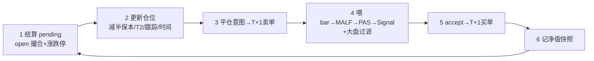

# M4 阶段小结：Signal 裁决层 + A 股回测事件循环

日期：2026-06-13
状态：已实现并验证（核心引擎）；交易方法迭代见 [TRADING_METHOD_REFINEMENT](TRADING_METHOD_REFINEMENT.md)，实证结论见 [VALIDATION_FINDINGS](VALIDATION_FINDINGS.md)

## 目标

在 PAS usage posture 之上建两层：**Signal**（唯一 accept/reject 裁决，产 SignalCandidate）+ **回测引擎**（唯一拥有仓位/订单/成交/盈亏语义，逐 bar 事件循环执行 A 股特化规则）。权威规范见 [BACKTEST_DESIGN](../02-module-design/BACKTEST_DESIGN.md)。

## 本质区别：延续 M1-M3，仍然没有 block

全程无施工卡/注册表/checks.py。治理只 pytest + git。构建顺序：契约 → 纯逻辑 → 引擎 → I/O → 测试。

## 已交付且验证

| 层 | 模块 | 职责 |
|---|---|---|
| Signal 契约 | `signal/types.py` | `SignalCandidate` + `SignalConfig` + `SignalDecision`/`RejectReason` 枚举 |
| Signal 裁决 | `signal/engine.py:judge` | 7 步判定：family→posture→质量门→RR→tradable→accept；不回写 PAS/MALF |
| 结构目标 | `signal/structural.py` | `compute_structural_targets`：结构 T1/T2 + 可变 RR + min_risk_pct 地板 |
| 回测契约 | `backtest/types.py` | `Order`/`Fill`/`Position`/`Trade`/`StructuralLevels` + reason 枚举 |
| A 股撮合 | `backtest/broker.py` | 集合竞价 open 成交 + 涨跌停（按 board）+ 停牌；复权双轨（限价用 raw_none） |
| 仓位规则 | `backtest/rules.py` | `open_position`（按实际 fill 重算）+ `advance`（破线/减半保本/T2/结构跟踪/时间止损） |
| 绩效指标 | `backtest/metrics.py` | total_return/cagr/max_dd/sharpe/win_rate/avg_R/expectancy/profit_factor |
| 事件循环 | `backtest/engine.py` | 6 步逐 bar 循环 + 大盘 regime 过滤 + 混合 Trade 记账 |
| 运行封装 | `backtest/runner.py` | load 双价线 + 预算 PAS/结构价/大盘 regime → 跑引擎 |
| 落库 | `storage/backtest_writer.py` | 6 表（param_set/backtest_run/bt_trade/equity/metrics/signal_candidate） |
| CLI | `scripts/run_backtest.py` | 单组回测 + 验收自检 + `--write` |

合计 **189 测试全绿**（M4 专项：signal 34 + backtest 43 + analyze 9，叠加 M1-M3 的 103 无回归）。

## 回测事件循环（§5，逐 bar 严格因果）

> **无未来函数铁律**：扫描只用 ≤ bar_dt 数据；进场永远在发现日的下一交易日 open；PAS 快照/结构价/大盘 regime 由 runner 预算、引擎按 bar_dt 只读当日（方案 A）。pivot 确认延迟 k 根天然满足因果。

## A 股交易规则（精确建模）

T0 发现 → T1 进场（集合竞价 open）→ 初始止损 `T0.low − stop_offset`（floor 到 min_risk_pct×entry）→ 1R = entry − stop → 达 T1 减半 + 拉保本 → 达 T2 清剩余 / 结构跟踪止损 → 时间止损。买入日破线 T2 清仓。T+1 当日不可卖；涨停拒买、跌停拒卖。

> `R_multiple = realized_pnl / (risk_unit_R × original_qty)`——调参与统计核心。减仓多腿合并为一行混合 Trade。

## 验收

- **手算对账**（`test_backtest_engine.py`）：单标的 2-3 笔逐字段对账 entry/stop/1R/结构T1T2/减半/保本跟踪/R_multiple。
- **A 股约束**（`test_backtest_broker.py`/`test_backtest_rules.py`）：T+1、涨跌停、破线、时间止损。
- **无未来函数**：进场 dt = 发现 dt 下一交易日；只读 ≤ bar_dt。

## M4 边界声明（收尾）

> **M4 交付的是「回测引擎 + Signal 裁决契约」，已完成并验证**——189 测试绿、手算对账过、无未来函数审计过。这部分是**工程交付**，完整且可用。
>
> **交易方法的盈利/稳健性不是 M4 的验收门。** 交易方法是研究产物，本就没有「完成」态——它要反复证伪、迭代、可能永远在调。第1套方法（质量门 + 结构 T1/T2 + 保本跟踪）目前已实证**未达稳健**（见 [VALIDATION_FINDINGS](VALIDATION_FINDINGS.md)），这是研究的中间状态，**不影响 M4 引擎契约的完成判定**。
>
> 因此 M4 **以「引擎契约完成」收场**；交易方法的诊断与迭代从 **M5-01** 起，作为独立的、持续的研究线推进。

## 下一步

- **引擎契约（M4）**：已闭合，作为基线（commit 61b3f32）冻结。不为策略表现去动 Signal 契约测试（裁决顺序/质量门/RR/T1T2/life_state）。
- **交易方法研究（M5-01 起）**：第1套方法诊断——止损宽度（min_risk_pct）+ 大盘过滤替代方案（MALF regime → MA60）。只跑 initial/validation，🔒 holdout 禁止。见 [TRADING_METHOD_REFINEMENT](TRADING_METHOD_REFINEMENT.md) + [VALIDATION_FINDINGS](VALIDATION_FINDINGS.md)。
- **M5 工程**（调参网格 + holdout 锁 + UI Page1/2）：放大器，排在方法骨架稳定**之后**。
