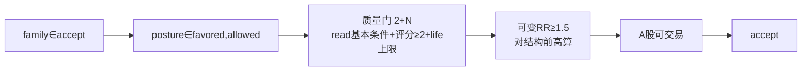

# 交易方法精炼：吸收四本经典实战

日期：2026-06-13
状态：已实现（第1套方法）；稳健性仍在迭代，见 [VALIDATION_FINDINGS](VALIDATION_FINDINGS.md)

## 背景

M4 回测引擎落地后，最初的交易规则是直觉拍的（移动止损强制高于 target1、RR 恒等于 1.0 惰性、单维 posture 进场）。精读四本价格行为/趋势经典后，按其共识重构进场筛选与出场管理，形成「第1套方法」。

## 四书吸收对照

| 来源 | 吸收点 | 落到代码 |
|---|---|---|
| **LanceBeggs YTC**（卷3 交易策略） | T1/T2 分批：第一部分到 T1 锁 1:1，第二部分让利润奔向 T2（结构 S/R）或跟踪止损；**保本第一**（达 T1 拉保本，不强求清仓价>target1） | 结构 T1/T2 + 达 T1 拉保本 + 结构跟踪 |
| **许佳冲《裸K线交易法》** | 「2+N 信号评级」（基本条件 + N 个细节共振）；报酬风险比 **≥1.5** 筛选机会 | PAS 质量门 `_quality_gate` + `min_reward_risk=1.5` |
| **Bob Volman《外汇超短线》** | 区分震荡区（≈transition）与趋势（≈trend up/down）；趋势中顺势、不在边界硬突破 | premise/posture 已编码结构态；质量门 premise∈actionable |
| **达瓦斯/立花义正** | 箱体台阶式移动止损：新结构确立才上移止损、只上不下；趋势跟随让利润奔跑 | 结构跟踪按 guard（最近确认 HL）逐级上移 |

> **共识收敛**：进场看质量分级（不止单维 posture）+ 真实风报比筛选；出场保本第一 + 按结构台阶跟踪 + 分批让利润奔跑。

## 系统已有的「质量分级」原料（关键洞察）

PAS 早已逐 bar 算出并入库完整质量信号——`read_status`（信号强度）、`directional_premise`（是否在关键位）、三个 `evidence_count`、C6 三旗标——但旧 Signal 只用了「posture∈{favored,allowed}」一维（相当于许佳冲「2+N」里只看了细节④）。精炼的本质是**让 Signal 消费 PAS 已算好的质量分级**，不是新造评分。

## 设计决策 D1–D5（锁定）

| # | 决策 | 内容 |
|---|---|---|
| **D1** | 移动止损不变量 | **保本第一 + 逐级跟踪**：达 T1 时 `current_stop ← 入场价`，之后按 guard 逐级上移、只上不下、地板=入场价。清仓价 ≥ 入场价、**可低于 target1**。删除旧 `max(trail, target1+ε)` |
| **D2** | 第二目标 T2 | **量度移动投影**：`T2 = 前高 + (前高 − guard)`；算不出（guard 缺失）则第二部分纯靠跟踪兜底 |
| **D3** | 可变风报比 | **RR 对结构前高算**：`reward_risk = (前高 − entry)/(entry − stop)`；`min_reward_risk=1.5`。无结构前高 → 退 1.0 < 1.5 拒绝。惰性 RR 路径消除 |
| **D4** | PAS 质量门 | **多维 accept 门（2+N）**：基本条件 `read_status∈{strong,mixed}`；评分满分 5（posture=favored/read=strong/premise可操作/证据偏强/无C6旗标）；门槛 `min_quality_score=2`。life_state 上限排除 terminal/stagnant 衰竭波 |
| **D5** | T1 取近 | `T1 = min(前高, entry+1R)`。因 RR≥1.5 意味着前高在 1.5R 之外，被 accept 的单子 target1 恒等于 entry+1R；「取近」只在该拒绝的单子上作退化保护 |

## 进场判定流（7 步）

## 验证

`tests/test_signal_engine.py`（24）+ `test_signal_structural.py`（10）+ `test_backtest_rules.py`（13）覆盖质量门各分支、可变 RR、结构 T1/T2、保本跟踪不变量（清仓价≥入场价、可低于 target1）。

## 诚实记录

第1套方法**逻辑骨架成立但尚未验证为稳健**——200 只主板跨时间组验证显示赢家引擎（target2/trailing）正常，但左尾（止损过紧）+ 无有效熊市过滤拖累整体。详见 [VALIDATION_FINDINGS](VALIDATION_FINDINGS.md)。**方法仍在迭代，未定稿。**
