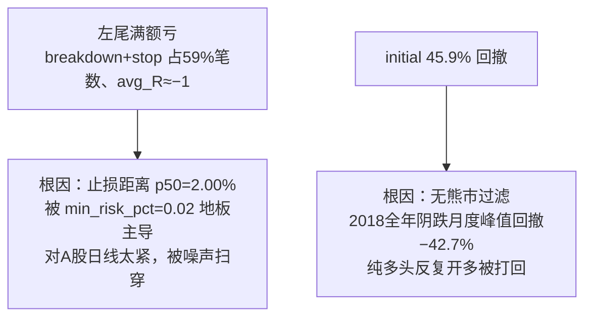

# 验证基础设施与第1套方法实证结论

日期：2026-06-13
状态：**第1套方法未达稳健，仍在迭代**（如实记录，不粉饰）

## 验证基础设施（已交付）

| 工具 | 职责 |
|---|---|
| `data/loader.py:select_symbols` | 按 board/上市天数/ST 从 instrument 选股票池（默认只选 asset_type=stock，防指数污染） |
| `scripts/validate_method.py` | 固定参数跨时间组验证：选池 → initial+validation 各跑一次 → 落库 → 并排对比。🔒 拦截 holdout |
| `scripts/analyze_run.py` | 只读 backtest 库做分布分析：R 分位/直方、exit_reason 占比+毛盈亏贡献、target2 命中率、按 setup_family/read_status 分层、reject 占比。🔒 拦截 holdout |
| `backtest/runner.py:prepare_market_regime` | 沪深300 跑 MALF 取大盘 system_state 序列 |

数据基础：5496 只标的（main 3193/chinext 1393/star 605/bse 303）+ 100 指数，3270 万 bar 灌入 market 库。

> 🔒 **holdout(2024-2026) 全程未跑**——是最终验证集，validate_method/analyze_run 对 `group_name='holdout'` 显式 `SystemExit` 拦截。

## 实证结论：第1套方法未达稳健

### 单标的不可信（标的选择问题）

920000.BJ（北交所高波动小票）7 笔全亏、profit_factor=0。**这是标的选择问题，非方法问题**——单只高波动小票无统计意义。

### 50 只 ×2023 是幸存者偏差

50 只主板 ×2023：pf=1.74、total_return=+12.9%、max_dd=2.9%。曾以为方法有效，但放大到 200 只即被摊平——**小样本碰巧多了几个 target2 大赢家**。

### 200 只主板跨时间组（基线，无大盘过滤）

| 指标 | initial(2018-20) | validation(2021-23) |
|---|---|---|
| profit_factor | 0.94 | 1.00 |
| total_return | −14.8% | −0.1% |
| max_drawdown | 45.9% | 22.7% |
| avg_R | +0.014 | +0.030 |

**两组都不赚。** 但分布诊断证明**赢家引擎是好的**：target2 出场 avg_R≈+5.5、贡 40% 毛盈；trailing avg_R≈+0.6、贡 37%。R 分布右尾真实（max +21.75）。

## 诊断：两个结构性漏洞（两组一致 → 非噪声）

## 大盘过滤尝试：MALF regime 滞后，反恶化 initial

加沪深300 MALF system_state 过滤（down_alive 停开多）后：

| 指标 | initial | validation |
|---|---|---|
| profit_factor | 0.94 → **0.80** ❌ | 1.00 → **1.10** ✅ |
| total_return | −14.8% → **−38.0%** ❌ | −0.1% → **+24.8%** ✅ |
| max_drawdown | 45.9% → **55.2%** ❌ | 22.7% → **18.9%** ✅ |

**validation 改善但 initial 反而恶化。** 根因：沪深300 的 MALF `down_alive` 占比太低（2018 仅 30%、2020 仅 7.4%），**MALF 结构确认滞后于急跌**——挡掉的是下跌中后段（相对低点），放行了下跌初期的 transition 和反弹末端的 up_alive。

## 当前状态与下一步

- `min_risk_pct` 当前仍 **0.02**（放宽止损 0.045 尚未落地）。
- 大盘过滤的 regime 信号待迭代（MALF system_state 滞后 → 候选：指数 MA60 均线，响应更快）。
- **第1套方法仍在修，未定稿。** 验证基础设施的价值正在于：诚实拦下了一个看似能赚（50 只 +12.9%）实则不稳健的方法，避免误判为成功。

> 这正体现 docs/README.md 的原则——**「不把文档完整误当成系统完成」**。
