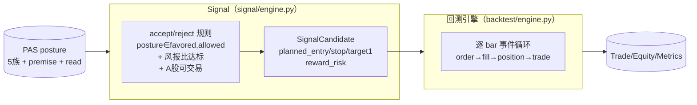
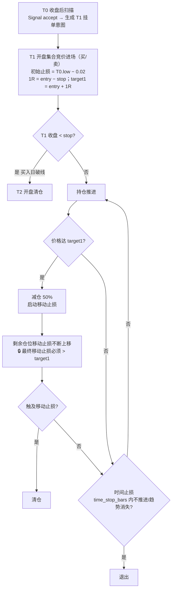
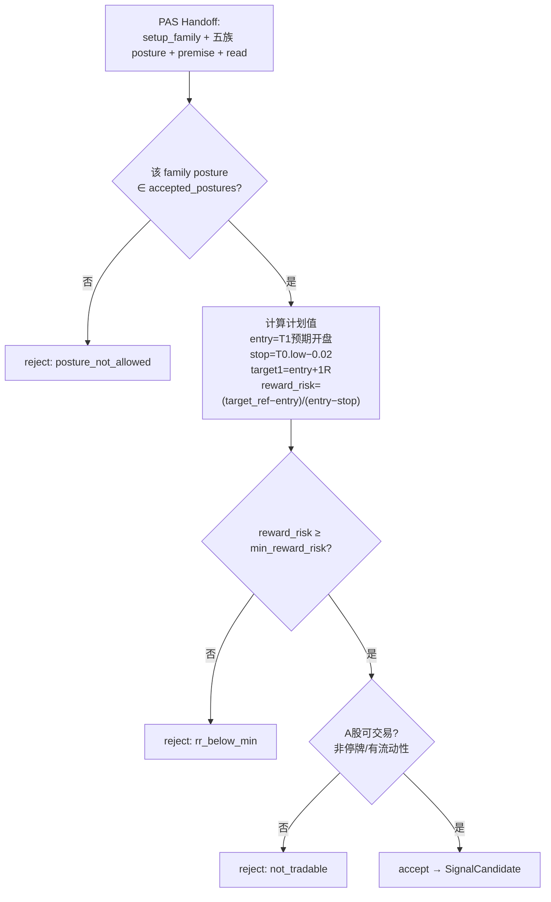
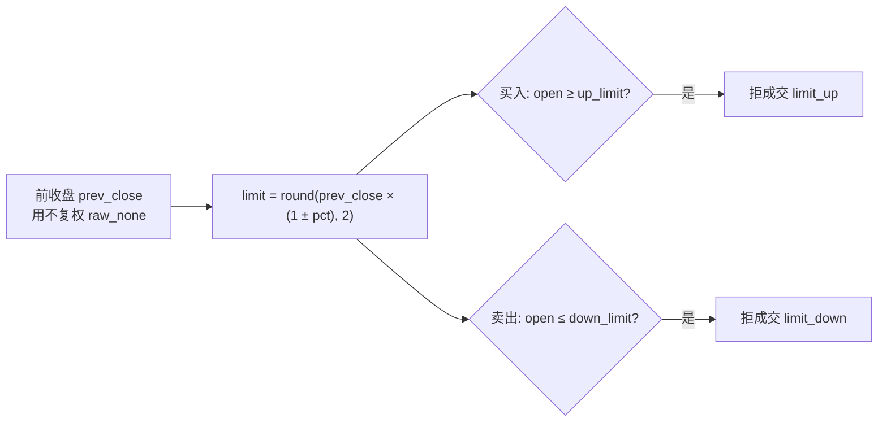
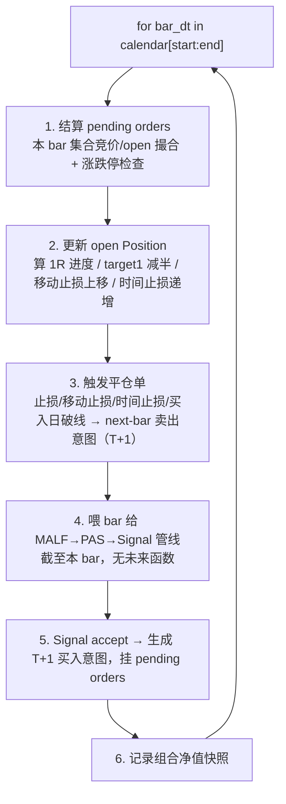
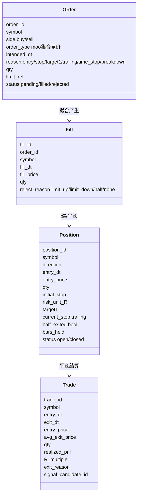
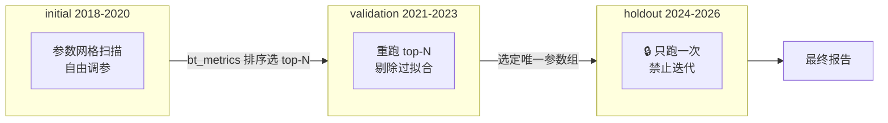

# 回测引擎 + Signal 设计（A 股特化，自写事件循环）

> **回测与 Signal 单一权威实现规范**。把用户的 A 股交易规则、Signal accept/reject 判定、事件循环顺序钉死。
> 这是 M4 的实现依据。**回测层是唯一拥有仓位/订单/成交/盈亏语义的层**——上游 MALF/PAS/Signal 都不碰这些。

| 权威边界 | 内容 |
|---|---|
| Signal 职责 | 读 PAS posture + 风报比规则，独立做 **accept/reject**，产 SignalCandidate（含进场/止损/目标**计划值**） |
| 回测职责 | 唯一拥有仓位/订单/成交/盈亏；逐 bar 事件循环执行 A 股特化交易规则 |
| 为什么自写 | 规则太 A 股特化（T+1/集合竞价/涨跌停/1R 减半/移动止损高于 target1/时间止损），现成框架（backtrader/backtesting.py）要硬掰、更易错 |
| 不做 | broker/paper-live/实盘对接 |

---

## 1. 职责切分

---

## 2. 用户交易规则（精确建模，不可走样）

时间轴：**T0 = 机会发现日**（收盘后扫描），**T1 = 进场日**，**T2 = 次日**。

### 规则逐条钉死

| # | 规则 | 形式化 |
|---|---|---|
| 1 | 机会发现 | T0 收盘后扫描，Signal accept → 生成挂单意图 |
| 2 | 进场 | T1 开盘集合竞价执行（买/卖） |
| 3 | 初始止损 | `stop = T0.low − 0.02` |
| 4 | 风险单位 | `1R = entry_price − stop`；`target1 = entry_price + 1R` |
| 5 | 买入日破线 | T1 收盘 `< stop` → T2 开盘清仓 |
| 6 | 达 target1 | 减仓 50%（`scale_out_pct` 可配，默认 0.5） |
| 7 | 移动止损 | 剩余仓位移动止损不断上移，触及即清仓；**最终移动止损必须 > target1** |
| 8 | 时间止损 | `time_stop_bars` 内价格不动/趋势消失 → 退出 |
| 9 | A 股约束 | T+1（买入次日才可卖）；涨停无法买入、跌停无法卖出；集合竞价撮合 |

> **🔒 移动止损不变量（规则 7）**：减仓后剩余仓位的移动止损用 `current_stop = max(trail_calc, target1 + ε)` 约束，保证清仓价高于 target1（已锁定第一目标利润）。

---

## 3. Signal 判定（accept/reject + 风报比）

| 参数 | 默认 | 说明 |
|---|---|---|
| `accepted_postures` | `{favored, allowed}` | 接受哪些 posture 档位（可收紧为只 favored） |
| `min_reward_risk` | 1.0 | 最小风报比门槛 |
| `target_ref` | target1 | 风报比计算的目标参考（MVP 用 target1） |

> Signal 独立裁决（PAS C-T3）；reject 结果记 SignalFeedback，**不回写** PAS/MALF。

---

## 4. 涨跌停判定（撮合约束）

| board | 代码前缀 | 涨跌停 |
|---|---|---|
| 主板 main | 60/00 | ±10% |
| 创业板 chinext | 30 | ±20% |
| 科创板 star | 688 | ±20% |
| 北交所 bse | 8/4/920 | ±30% |
| ST | （名称含 ST/退） | ±5% |

> **复权双轨**：涨跌停用**不复权原始价**（`raw_none`）算限价，结构/进出场用**后复权**（`qfq_back`）。
> **MVP 简化**：集合竞价价 = T1 开盘价；`open ≥ up_limit` 买入失败、`open ≤ down_limit` 卖出失败（顺延）。board 精确化可后置。

---

## 5. 事件循环（backtest/engine.py，逐 bar 严格因果）

> **无未来函数铁律**：扫描只用 `<= bar_dt` 的数据；进场永远在发现日的**下一交易日** open。pivot 确认延迟 k 根天然满足因果（见 MALF_DESIGN §2.2）。

---

## 6. 关键数据结构（backtest/types.py，dataclass）

> **核心度量**：`R_multiple = realized_pnl / (risk_unit_R × original_qty)`——调参与统计的核心。

---

## 7. 调参 / 分组回测

### 7.1 时间分组（🔒 硬隔离）

> **holdout 铁律**：整个调参过程**只能跑一次**。`tuning/runner.py` 对 holdout 加运行计数锁。

### 7.2 可扫描参数（全部来自 config/params_default.toml）

| 类别 | 参数 | 默认 |
|---|---|---|
| pivot | `pivot_k` | 2 |
| 止损 | `stop_offset` | 0.02 |
| 时间止损 | `time_stop_bars` | 5/8/13 |
| 移动止损 | `trail_method`（chandelier/prev_HL/ATR×k）+ `trail_k` | — |
| 目标 | `target_R` + `scale_out_pct` | 1.0 / 0.5 |
| Signal 过滤 | `accepted_postures` + `min_reward_risk` | {favored,allowed} / 1.0 |
| universe | 最小流动性 + 上市天数 | — |

---

## 8. 回测结果存储（backtest.sqlite）

| 表 | 用途 |
|---|---|
| `param_set` | 参数网格的一个点（params_json） |
| `backtest_run` | 一次回测（绑定 param_set + group_name + 数据 cutoff） |
| `bt_trade` | 逐笔成交（含 R_multiple / exit_reason） |
| `bt_equity_curve` | 逐 bar 组合净值 |
| `bt_metrics` | 汇总（total_return/cagr/max_dd/sharpe/win_rate/avg_R/expectancy/profit_factor） |
| `signal_candidate` | 每个发现的机会（含 accept/reject + planned 进出场） |

---

## 9. 实现映射（代码在哪）

| 设计层 | 代码 | 状态 |
|---|---|---|
| Signal 数据契约 | `src/asteria/signal/types.py` | ⏳ M4 |
| Signal accept/reject + R:R | `src/asteria/signal/engine.py` | ⏳ M4 |
| 回测数据结构 | `src/asteria/backtest/types.py` | ⏳ M4 |
| A 股撮合（集合竞价/涨跌停/T+1） | `src/asteria/backtest/broker.py` | ⏳ M4 |
| 事件循环 | `src/asteria/backtest/engine.py` | ⏳ M4 |
| 仓位管理（止损/减半/移动/时间） | `src/asteria/backtest/rules.py` | ⏳ M4 |
| 绩效指标 | `src/asteria/backtest/metrics.py` | ⏳ M4 |
| 分组调参编排 | `src/asteria/tuning/runner.py` | ⏳ M5 |
| 持久化 | `storage/schema.sql`（backtest 库表已建） | ✅ M1 建表 |

---

## 10. 验证方式

1. **单标的手算对账**（M4 核心验收）：选 1 个标的 2-3 笔交易，手算 entry/stop/1R/target1 减半/移动止损/R_multiple，与引擎输出逐字段对账。
2. **A 股约束**：`pytest tests/test_backtest_rules.py`——T+1 买入当天不可卖、涨停拒买入、跌停拒卖出、买入日破线 T2 清仓、时间止损触发。
3. **无未来函数**：断言进场 dt = 发现 dt 的下一交易日；扫描数据 cutoff ≤ bar_dt。
4. **移动止损不变量**：减仓后清仓价必 > target1。
5. **端到端**：`python scripts/run_backtest.py` 跑单组 → `python scripts/run_tuning.py` 走完 initial→validation→holdout，UI Page2 三组指标并排。
