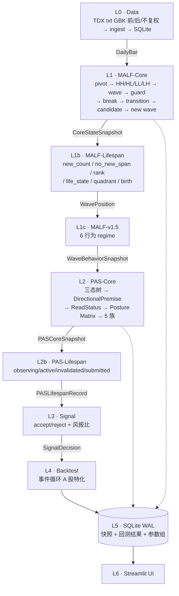
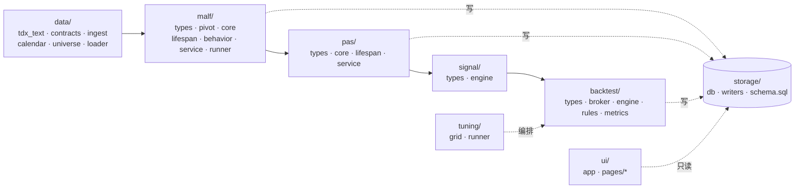
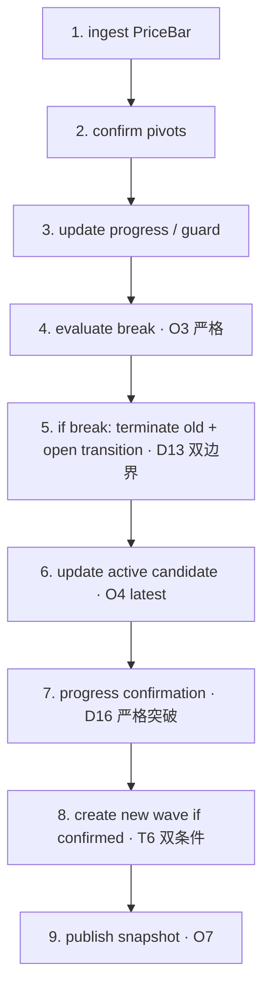
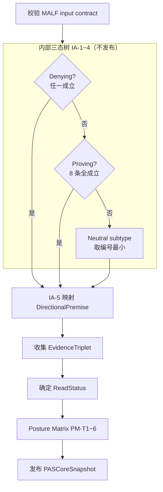
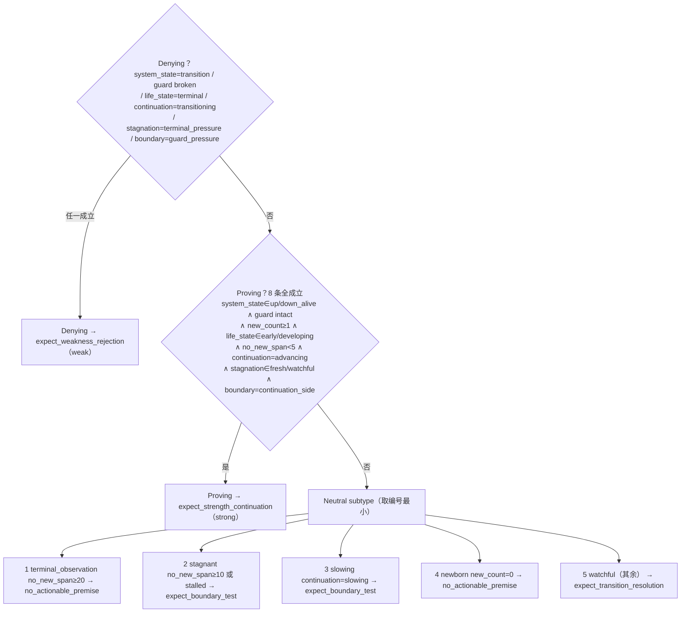
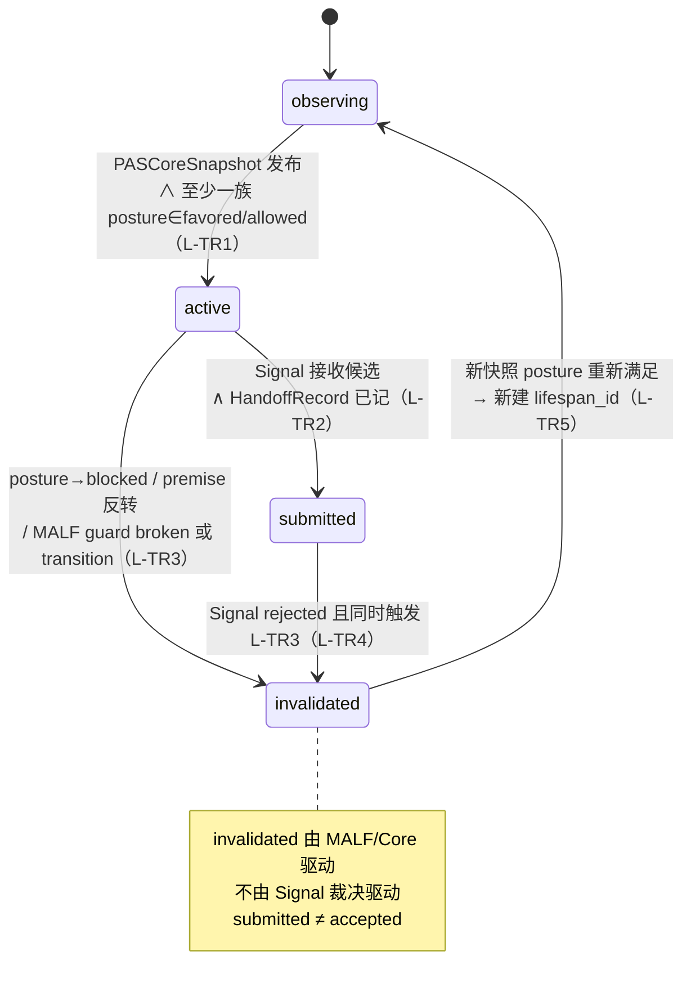
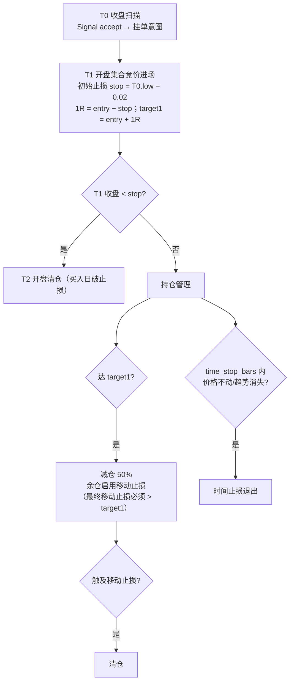
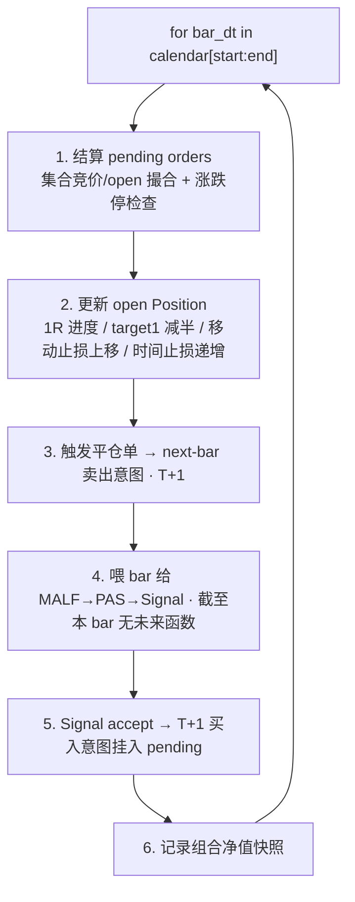
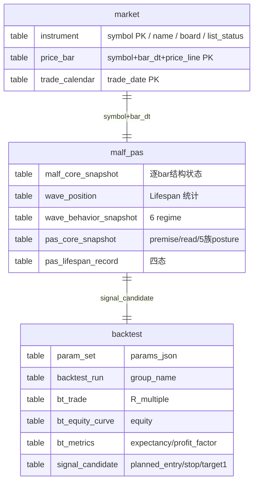

# Asteria-Malf-Pas MVP 实现设计 (v1.5)

> 经批准的重构计划，项目目录唯一参照。同步副本：`C:\Users\Administrator\.claude\plans\g-asteria-malf-pas-block-jaunty-nebula.md`（plan mode 临时产物）。
> 配套权威：MALF 见 `docs/MALF_DESIGN.md`；里程碑小结见 `docs/M*_SUMMARY.md`。

## Context（为什么做这次重构）

上一版 `H:\Malf-Pas` 能跑、能过 block，却经历几十次返工。根因**不是 AI 能力不够，也不是 MALF/PAS v1.5 领域逻辑本身重**，而是外围治理机械严重过载：

| 上一版治理负担 | 量级 |
|---|---|
| `checks.py` 单文件 | 6558 行 |
| TOML 注册表 | 50+ 个 |
| 施工卡状态机 | 74 张卡 |
| DuckDB 文件 | 16 个 |
| 文档/代码比 | 7:1 |
| 单文件硬上限 | 500 行 |

死循环：每改一步 → 手动同步注册表 → 治理校验失败 → 补文档 → 文档超行要拆 → 改交叉引用 → "block / 还能通过 / 继续开发"。

本次在全新空目录 `G:\Asteria-malf-pas` 重构，目标产出一个**能跑起来的、个人的、本地的**量化 MVP：能回测、可存储回测结果、能根据历史回测调教系统、能根据 signal + 风报比发现正预期交易机会，并有简单 UI。

### 四个已拍板的关键决策

| # | 决策 | 理由 |
|---|---|---|
| 1 | MALF/PAS **忠实复刻完整 v1.5 形式化规范** | 领域逻辑是有价值的部分，保留 |
| 2 | 回测引擎**自写小型事件循环** | 用户规则太 A 股特化，现成框架反而要硬掰 |
| 3 | 治理**砍掉重治理，只留 pytest + git** | 这是上一版被拖垮的根源 |
| 4 | 股票池**全 A 股，剔除 ST / 上市<1年 / 低流动性** | — |

数据/存储：DuckDB 单线程难用 → 退回 **SQLite (WAL)**。时间分组：initial=2018-2020，validation=2021-2023，holdout=2024-2026。

---

## 核心立场（贯穿全文的取舍）

| 层 | 只产 | 绝不产 |
|---|---|---|
| **MALF** | 结构事实（pivot/HH-HL-LL-LH/wave/break/transition/candidate/confirmation + 6 行为 regime） | 强弱分 / setup family / accept-reject / 交易动作 |
| **PAS** | usage posture（5 族 × 4 档）+ opportunity 四态生命周期 | accept/reject（内部三态树不发布）；禁读 PriceBar |
| **Signal** | accept/reject + 风报比（独立裁决） | 不回写 PAS/MALF |
| **回测** | 仓位 / 订单 / 成交 / 盈亏 | — |
| **治理** | pytest + git | 治理注册表 / checks.py / 施工卡 |

> `rule_version / lineage / source_run_id` 等字段在 MVP 里保留为**普通数据列**（可复现 + 调试），但不建任何 gate。

---

## 1. 架构总览（分层职责与数据流）

> **🔒 边界铁律（代码层强制）**：
> - MALF 不引用 PAS/Signal；PAS 不读 PriceBar、不重算 MALF；Signal 不回写；回测不回写上游
> - 每层输出 append-only 快照 + 一个 `*_latest` 视图（读加速，非新语义）
> - `system_state` 与 `wave_core_state` 永不混用
> - 严格突破比较（`<`/`>`，等于不算），价格先归一化精度再比较（O3）

---

## 2. 目录 / 模块结构

依赖方向单向：`data → malf → pas → signal → backtest`；`storage` 被各层调用但不反向依赖；`tuning` 编排 backtest；`ui` 只读 storage。每层 `types.py` 是纯数据契约（dataclass + 枚举），无副作用，最易测。

### 外置兄弟目录布局

> 沿用上一版治理：`.sqlite` 等数据产物**禁止进仓库根**，统一放仓库同级兄弟目录。

| 用途 | 目录 |
|---|---|
| 代码仓库 | `G:\Asteria-malf-pas` |
| 数据(SQLite) | `G:\Asteria-malf-pas-data`（`market` / `malf_pas` / `backtest`.sqlite） |
| 备份 | `G:\Asteria-malf-pas-backup` |
| 报告 | `G:\Asteria-malf-pas-report` |
| 临时(spill/checkpoint) | `G:\Asteria-malf-pas-temp` |
| validated | `G:\Asteria-malf-pas-validated` |

- `config/settings.py` 以这套外置根为准；数据不在仓库里，`.gitignore` 仍兜底排除 `*.sqlite`。
- **远端仓库**：`https://github.com/everything-is-simple/Asteria-malf-pas`。

### 关键文件职责

| 模块 | 文件 | 职责 |
|---|---|---|
| data | `tdx_text.py` | [复用] TDX GBK 解析（路径 `stock/<Adj>/`） |
| data | `ingest.py` | txt → SQLite；增量按 content_hash |
| data | `universe.py` | board 推断 + 筛选（剔除 ST/上市<1年/低流动性） |
| data | `loader.py` | 喂 DailyBar 序列的只读 API |
| malf | `core.py` | Core 状态机（D1-D18, T1-T10, O1-O8） |
| malf | `lifespan.py` | new_count/span/rank/life_state/birth（L1-L18） |
| malf | `behavior.py` | v1.5 六 regime → WaveBehaviorSnapshot |
| pas | `core.py` | 三态树(IA-1~5)+Posture Matrix(PM-T1~6) |
| backtest | `broker.py` | A 股撮合：集合竞价/涨跌停/T+1 |
| backtest | `engine.py` | 事件循环：signal→order→fill→manage |
| backtest | `rules.py` | 仓位管理：初始止损/减半/移动止损/时间止损 |
| storage | `db.py` | SQLite 连接(WAL) + schema 分段建表 |
| tuning | `runner.py` | 分组回测(initial/validation/holdout) 编排 |

---

## 3. MALF v1.5 实现设计

> 完整权威规范见 **`docs/MALF_DESIGN.md`**（图表化）。此处仅列实现要点与本计划的取舍锚点。

### 3.1 pivot 检测（malf/pivot.py）

- 结构层用**后复权(backward)**，break/guard 比较不被除权跳空污染。
- **分形确认（fractal-k）**：H 在前后各 k 根 bar 的 high 都不高于它时确认（L 对称）。`pivot_k` 默认 2。
- **确认延迟 k 根**（与 O2 一致）：pivot 价格属极值 bar，确认时间 = confirm bar。
- 确定性：算法固定 + k 固定 ⇒ pivot 序列唯一。`pivot_detection_rule_version = "fractal-k2-v1"`。

### 3.2 Core 状态机（malf/core.py）— O2 九步事件顺序

| 确定性关键点 | 规则 | 源 |
|---|---|---|
| 初始化 | `H0→L1→H2 且 H2>H0` 才生 initial up wave；不足保持 uninitialized，绝不 break/transition | D18/O6 |
| guard 唯一性 | HH/LL 只动 progress_extreme，仅后续确认 HL 替换 current_effective_HL | D9/T3 |
| break | `up: bar_low < HL.price`（严格，等于不算），记 8 字段 | D10/O3 |
| transition boundary | 旧 up → high=old HH, low=broken HL；不可用 break bar high/low | D13 |
| candidate | active = latest，新候选即替换；记 replacement_count | O4/T5 |
| new wave 确认 | active_candidate 存在 **且** 其后 confirmation 突破，缺一不可 | T6/T7 |
| 旧波不复活 | terminated 永不回 alive | T4 |

> 价格比较前 `round` 2 位（`epsilon_policy = none_after_price_normalization`）。

### 3.3 Lifespan / 3.4 Behavior

详见 `docs/MALF_DESIGN.md` §3、§4。要点：rank 用预计算样本（MVP 简化，`sample_cutoff ≤ 当前 bar` 防前视）；6 regime 纯派生 + 比较铁律（transition 优先、无 guard 不出 guard_pressure）。

---

## 4. PAS v1.5 实现设计

### 4.1 定位

PAS = MALF 的 **usage policy layer**。输入只有 `WavePosition + WaveBehaviorSnapshot`（公理 A1，C8 禁读 PriceBar）。输出只有"当前适合用什么 setup"（posture），不做 accept/reject。

### 4.2 PAS Core 确定性流水线（PAS_01B C2）

### 4.3 内部三态树（IA-1~4，硬阈值照搬）

> **🔒** IA-3 的 `no_new_span<5`、IA-4 的 `≥20/≥10` 是文档**写死的硬阈值**，照搬不可改。

### 4.4 Posture Matrix（PM-T1~T6，确定性查表）

| 定理 | 触发条件 (Premise + ReadStatus) | TST | BOF | BPB | PB | CPB |
|---|---|---|---|---|---|---|
| PM-T1 | strength_continuation + strong | allowed | blocked | **favored** | **favored** | deferred |
| PM-T2 | weakness_rejection + weak | allowed | **favored** | blocked | blocked | deferred |
| PM-T3 | boundary_test + mixed | **favored** | allowed | deferred | deferred | deferred |
| PM-T4 | transition_resolution + ambiguous | deferred | deferred | blocked | blocked | blocked |
| PM-T5 | no_actionable_premise / not_applicable | blocked | blocked | blocked | blocked | blocked |
| PM-T6 | ReadStatus 与 Premise 不匹配 | 全体降一档（favored→allowed→deferred→blocked），只降一次 |

> **上限约束 (C6)**：transition_bound / lineage_gap / ambiguity 主导 → 上限 deferred；无 lineage / premise=no_actionable → 全 blocked。

**PASCoreSnapshot 禁止字段**：三态标签、数值分数、accept/reject/buy/sell/order/position/fill/profit。

### 4.5 PAS Lifespan 四态机

### 4.6 PAS Service + Signal Feedback

- Service 只读发布：PASCoreSnapshot(Latest)、PASCandidateRecord(Latest)、PASLifespanRecord、PASServiceHandoffRecord。
- **SignalFeedback (PAS_04)**：`signal_decision∈{accepted,rejected}` + reason + version，**只用于 audit/统计/replay，绝不回写** Core/Lifespan/MALF。

---

## 5. Signal + 回测引擎设计

### 5.1 职责切分

| 层 | 做什么 | MVP 规则 |
|---|---|---|
| **Signal** | accept/reject（独立裁决） | family posture∈{favored,allowed} ∧ 风报比达标 ∧ A 股可交易 → accept，产 SignalCandidate（含进场/止损/目标计划值） |
| **回测引擎** | 唯一拥有仓位/订单/成交/盈亏 | 逐 bar 事件循环执行 A 股特化规则 |

### 5.2 用户交易规则形式化（T0=机会发现日收盘，T1=进场日）

> **A 股约束**：T+1（买入次日才能卖）；涨停无法买入、跌停无法卖出；集合竞价撮合。

### 5.3 涨跌停判定

| board | 比例 | 代码前缀 |
|---|---|---|
| 主板 | ±10% | 600/601/603/605/000/001/002/003 |
| ST | ±5% | 名称含 ST/*ST/退 |
| 创业板/科创板 | ±20% | 300/301/688 |
| 北交所 | ±30% | 8x/920/430 |

以前收盘价 `round(prev_close×(1±limit), 2)` 为限价。MVP 简化：`open≥up_limit` 无法买入；`open≤down_limit` 无法卖出（集合竞价价=open）。board 精确化作为参数后置。

### 5.4 事件循环（backtest/engine.py）

> 逐 bar 严格因果：扫描只用 ≤ bar_dt 的数据；进场永远在发现日的下一交易日 open。

### 5.5 关键数据结构（backtest/types.py）

| 结构 | 关键字段 |
|---|---|
| Order | order_id, symbol, side, order_type(moo), intended_dt, reason(entry/stop/target1/trailing/time_stop/breakdown), qty, status |
| Fill | fill_id, order_id, fill_dt, fill_price, qty, reject_reason(limit_up/limit_down/halt/none) |
| Position | position_id, symbol, entry_dt, entry_price, qty, initial_stop, risk_unit_R, target1, current_stop, half_exited, bars_held, status |
| Trade | trade_id, entry/exit_dt, entry/avg_exit_price, qty, realized_pnl, R_multiple, exit_reason |

> `R_multiple = realized_pnl / (risk_unit_R × original_qty)`，调参/统计核心度量。

---

## 6. SQLite Schema 设计

### 6.1 连接策略

| 项 | 设置 |
|---|---|
| 位置 | `G:\Asteria-malf-pas-data\*.sqlite`（外置） |
| WAL | `PRAGMA journal_mode=WAL; synchronous=NORMAL;`（并发读 + 单写） |
| 写者 | 管线/回测串行写；UI 只读 `mode=ro` |
| 分库 | `market`（行情）/ `malf_pas`（结构 posture 快照）/ `backtest`（结果 参数组） |

### 6.2 三库表（详见 `src/asteria/storage/schema.sql`）

> 全部 append-only 快照表带 `source_run_id` + `UNIQUE(symbol,timeframe,bar_dt,source_run_id)`；PAS 内部三态字段不入库。

---

## 7. 调参 / 分组回测设计

### 7.1 时间分组（硬隔离）

> **🔒 铁律**：holdout 整个调参过程**只能跑一次**。`tuning/grid.py` 对 holdout 加运行计数锁。

### 7.2 参数网格（全部来自 config）

| 参数 | 候选 |
|---|---|
| pivot_lookback | 2 / 3 / 5 |
| stop_offset | 0.02（默认） |
| time_stop_bars | 5 / 8 / 13 |
| trail_method + trail_k | chandelier / prev_HL / ATR×k |
| target_R + scale_out_pct | 1.0 + 0.5（默认） |
| signal filter | 接受哪些 posture + min_reward_risk |
| universe filter | 最小流动性 / 上市天数 |

### 7.3 工作流（tuning/runner.py）

1. initial 组笛卡尔积扫描（每点一 backtest_run）。
2. 用 bt_metrics（expectancy/profit_factor/max_dd）排序选 top-N。
3. validation 组重跑 top-N，剔除过拟合。
4. 选定唯一参数组 → holdout 跑一次 → 最终报告。

> 串行写库（SQLite 单写）；可 multiprocessing 并行算 param 点，主进程串行 flush。

---

## 8. Streamlit UI 设计（最小可用，只读连接）

| 页 | 内容 |
|---|---|
| **Page 1 机会列表** | 选日期 → 查 signal_candidate；表格 symbol/family/premise/read_status/5族posture/entry/stop/target1/RR/decision；按 RR 排序、按 family 过滤 |
| **Page 2 回测结果** | 选 run → bt_metrics 卡片 + equity curve + trade 列表 + R 分布直方图；三组并排对比 |
| **Page 3 结构可视化** | 选 symbol + 日期 → candlestick 叠加 pivot/wave/guard/transition/break；下方逐字段显示 WavePosition + 6 regime + PAS 5 族 posture。**M1 核心调试视图** |

---

## 9. 分阶段实施路线（里程碑）

| 里程碑 | 交付 | 验证 |
|---|---|---|
| **M1** ✅ | TDX 解析+ingest；pivot+Core 状态机；Structure Inspector | 600000 肉眼正确，event ordering 可重放 |
| **M2** ⏳ | 计数/rank/life_state/quadrant/birth + 6 regime | 字段齐全，transition 保留 old_direction，rank 单调性 |
| **M3** | 三态树 → premise → read → posture matrix + 四态机 | posture matrix 全枚举确定性，C6 上限 + PM-T6 降档 |
| **M4** | accept/reject + 事件循环（T+1/止损/减半/移动/时间/涨跌停） | 单标的手算 1-2 笔对账，无未来函数 |
| **M5** | 参数网格 + 三组工作流 + holdout 锁 + Page1/Page2 | initial→validation→holdout 全流程跑通 |

---

## 10. MVP 务实取舍

> 原则：**接口字段保留完整（按规范定义），但派生逻辑可先用桩/简化实现**，后续填充不改接口形状。

### 完整实现（系统正确性的根）

MALF Core 全状态机；MALF v1.5 六 regime；PAS Core 三态树 + posture matrix；回测引擎 A 股交易规则。

### 简化/桩实现

| 规范项 | MVP 取舍 | 接口保留 |
|---|---|---|
| Lifespan rank peer_sample 版本化 | 全市场同方向 + 截至当前 bar 单一样本，sample_version 常量 | ✅ |
| lineage_hash / 完整 rule_versions 审计链 | 简单字符串或 run_id，不做哈希校验 | ✅ |
| replay determinism 正式校验(O8) | 靠 pytest 固定快照 | ✅ rule_version |
| PAS reason codes 全文 | 短 enum/分支名 | ✅ |
| EvidenceTriplet 详细证据 | 命中 regime 名列表 | ✅ 三数组 |
| *Latest 物化表 | SQL MAX(bar_dt) | 后续可加 |
| 多 timeframe(week/month) | 只做 day | ✅ timeframe |
| index/block 资产 | 只做 stock | ✅ asset_type |

### 明确不做

broker / paper-live / 实盘对接（规范禁止）；正式 DB mutation 治理、施工卡、governance registry（本次重构核心目的就是砍掉）。

### 关键技术决策

| 决策 | 内容 |
|---|---|
| **复权** | 结构与回测用后复权（连续不跳空）；涨跌停判断用不复权原始价另算。两套都 ingest，`price_line` 区分 `qfq_back`/`raw_none` |
| **涨跌停** | 用不复权收盘价算次日限价；symbol→board 从代码前缀推断。MVP 先统一 ±10% 近似，board 精确化后置 |
| **集合竞价** | MVP 用 T+1 开盘价作成交价；涨停 open=涨停价则买入失败，跌停同理 |

---

## 11. 依赖与环境

Python 3.11+；依赖 `pandas / numpy / streamlit / plotly / pytest`；**不依赖 duckdb 及任何治理框架**；SQLite 用标准库 `sqlite3`(WAL)；包管理 `uv` 或 pip+venv，pyproject.toml 最小化。

## 12. 测试策略（pytest only）

| 测试 | 覆盖 |
|---|---|
| `test_malf_core.py` | 合成序列断言 pivot/wave/break/transition/candidate/confirmation；O3 边界 == 不触发 |
| `test_malf_behavior.py` | regime 派生查表正确性 |
| `test_pas_core.py` | posture matrix 全枚举(5×5) + PM-T6 降档 + C6 上限 |
| `test_backtest_rules.py` | 单标的手算对账（进场/止损/减半/移动/时间/涨跌停拒成交） |
| `test_data_ingest.py` | TDX 解析（GBK、日期格式、复权目录） |
| 黄金样本 | 2-3 标的固定时段存期望快照，回归测试 |

## 验证方式（端到端）

| # | 阶段 | 命令 |
|---|---|---|
| 1 | M1 后 | `python scripts/ingest_data.py` → `streamlit run src/asteria/ui/app.py` 核对 600000 结构标注 |
| 2 | 每里程碑 | `pytest tests/` 全绿 |
| 3 | M4 后 | `python scripts/run_backtest.py` 单组，手算对账 1-2 笔 R 倍数 |
| 4 | M5 后 | `python scripts/run_tuning.py` 走完 initial→validation→holdout，UI Page2 三组并排 |
